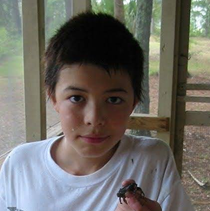

Hi, my name is Nate Park. I'm an origami artist, video game programmer, and perpetually injured rock climber.

#### [Origami]()

I have been designing and folding super complex origami for over 10 years. I used to go by OrigamiNate during the snkhan.co.uk/flickr era. More recently you can find me as OrigummyNate in the Origami-dan discord. I've exhibited my models in the OrigamiUSA NYC Convention. My favorite subjects to fold are nature and fantasy.

#### [Game Programming]()

I'm a gameplay and graphics programmer with more than 10 years experience in the game industry, and have contributed to various sequels, such as
- **Call of Duty: Black Ops III** @Treyarch
- **Call of Duty: WWII** @Sledgehammer Games
- **Forza Motorsport VIII** @Turn 10 Studios (Microsoft)
- **The Last of Us Part II** @Naughty Dog (Sony)
- **Cancelled Project** @(permanently shut down) Ready at Dawn (Meta)

Thanks for stopping by~

