Most code demos run in my game engine at https://github.com/Kaminate/Tac.

## Radiosity
Stochastic jacobi radiosity, with average radiance baked into vertex color (no final gather).
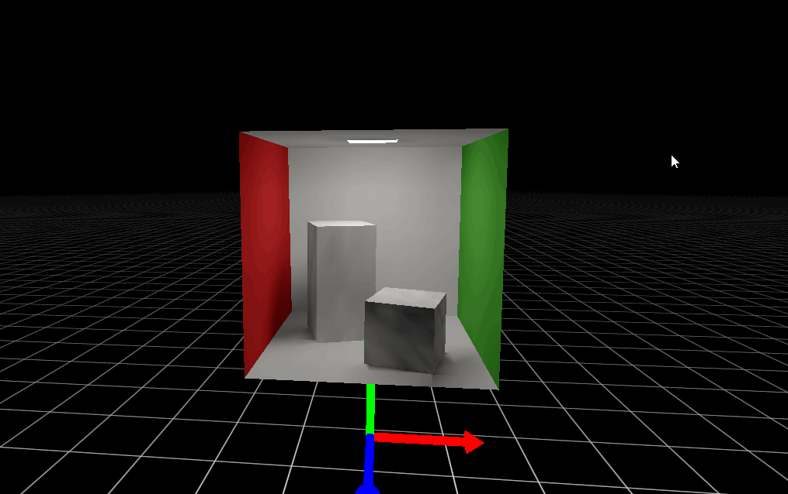

## Raytrace
Cpu raytracer with reflections, refractions, and depth of field
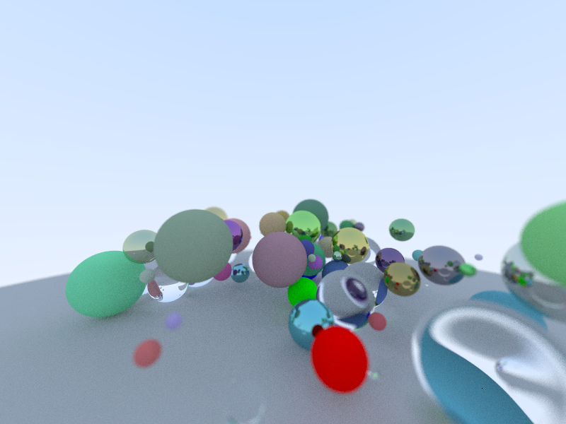

## IBL
A slide from a presentation I gave about 2014 Karis split-sum approximation.
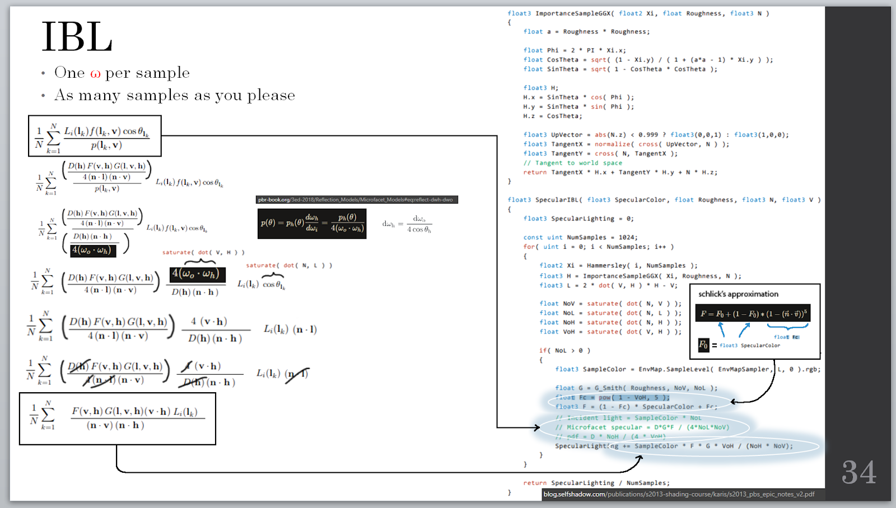

## Raymarch
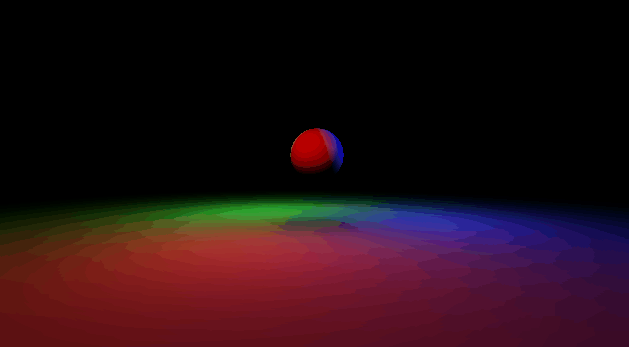

## Voxelization
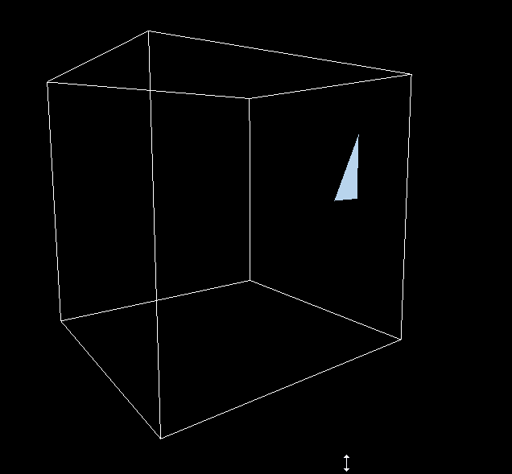

## Torque
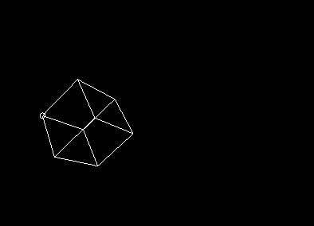

## Skinning
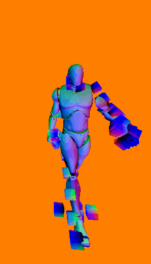

## Texture Repetition
iq's method

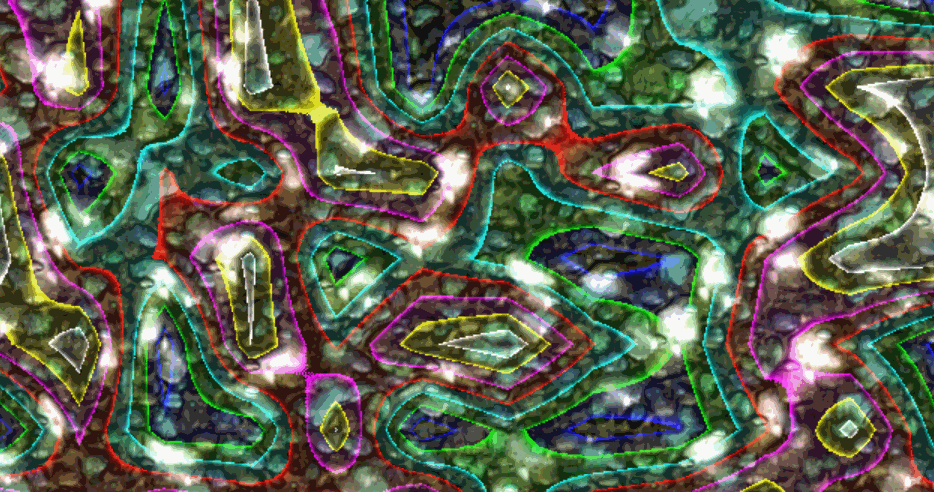

## Shadows
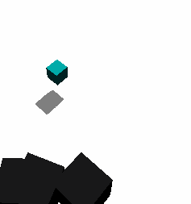

## Normal Map
Cube map, phong, reflections, normal map
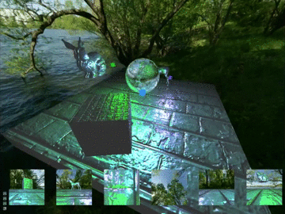

## Julia Fractal
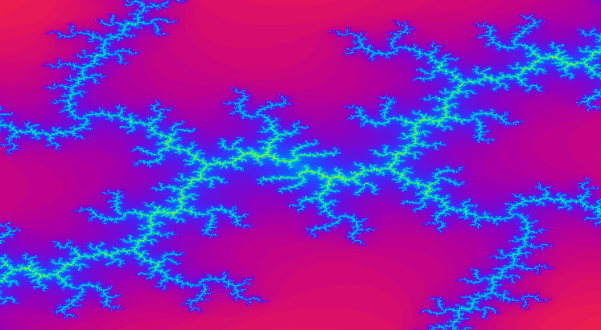
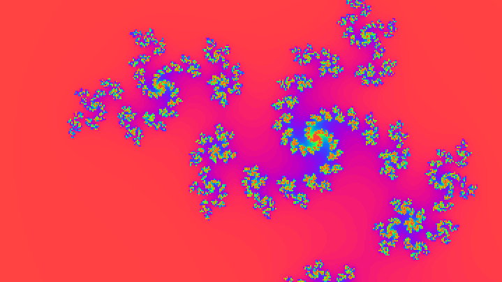

## GJK
Visualizing the minkowski difference
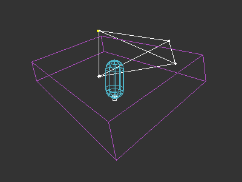

## SPH
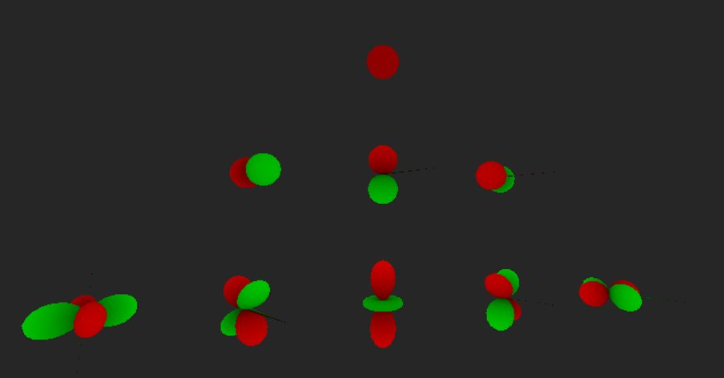

## Misc
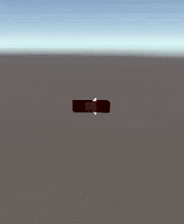
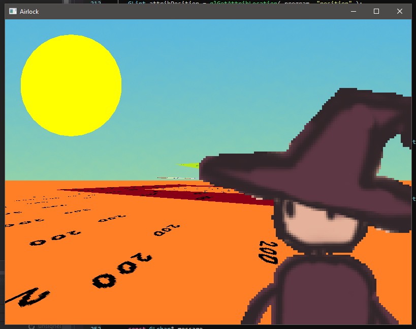
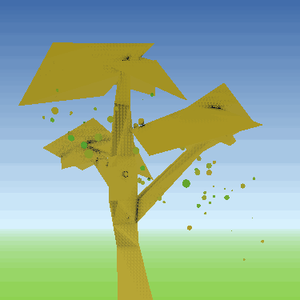
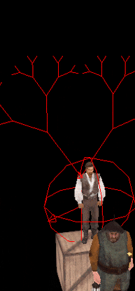
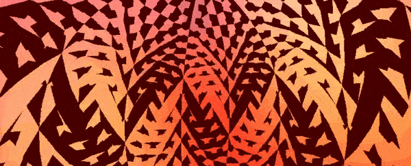
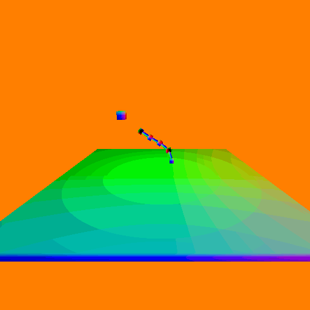
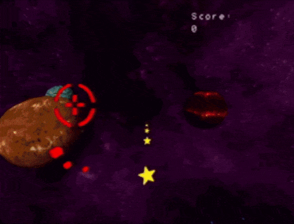
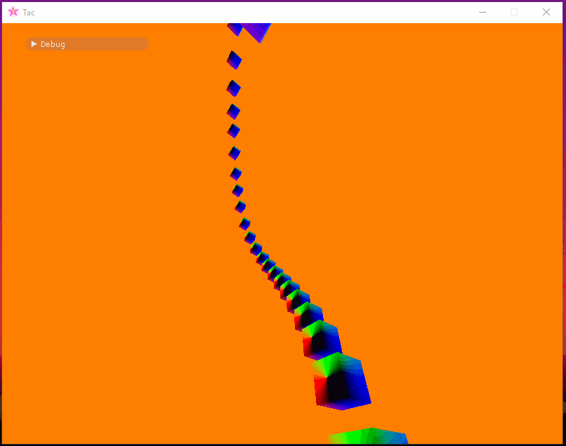
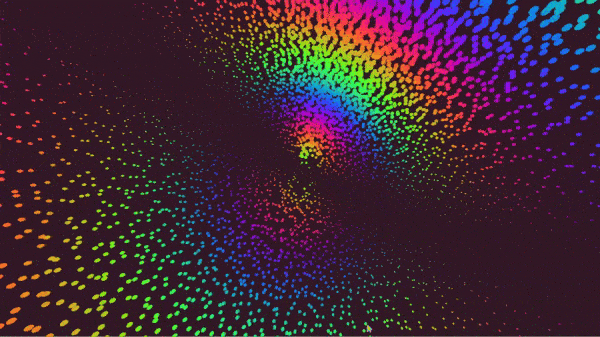
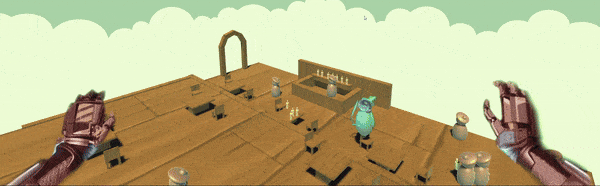

## Games worked on 

### The Last of Us Part II
[The Last of Us Part II](https://www.playstation.com/en-us/games/the-last-of-us-part-ii-ps4/)


### Forza Motorsport

[Forza Motorsport](https://forza.net/motorsport)


### Call of Duty: WWII
[Call of Duty: World War II](https://www.callofduty.com/wwii)


### Call of Duty: Black Ops III
[Call of Duty: Black Ops III](https://www.callofduty.com/blackops3)


## Student Projects

### Photon Bunny


[Photon Bunny](https://games.digipen.edu/games/photon-bunny) is a puzzle platformer based off of the properties of light.
You play as Cera bunny, and have to absorb and eject light throughout the world to escape from the evil PowerCorp.

December 2011 – April 2012

- Created a 2D physics engine using the GJK and EPA algorihms
- Lasers can reflect off of up to ten polygons
- Designed several levels

Producer / Gameplay Programmer – Justin Cook
Technical Director / Engine Programmer / Artist – Ming-Lun “Allen” Chou
Game Designer / Physics Programmer – Nathan Park
Product Manager / Tools Programmer / Music Composer – Garrett Woodford

2012 DigiPen Best Freshman Technology Award
2012 IGF Entrant

### Temple of the Water God


[Temple of the Water God](https://games.digipen.edu/games/temple-of-the-water-god) is a puzzle platformer in which the player is able to manipulate water to overcome challenges and escape the temple.

August 2012 – April 2013

- Built a buoyancy component for puzzle elements
- Implemented a dynamic AABB tree for fluid and game logic
- Created a data-driven user interface

Producer – Riley Pannkuk
Associate Producer / Lead Designer – Jonathan Chan
Technical Director – Steven George
Art Producer / Designer – Karyn McCollough ?
Design / Software Engineer – Nathan Park
Character Artist / Environments – Jenalle Norgren
Environment Artist / Backgrounds – James McWhirter
Music Designer – Seth Weedin
Sound Designer – Robert Snyder
Design Consultant – Griffin Dean

DigiPen Best Sophomore Technology Award

### Waboom


WABOOM is a fast paced online first person shooter with one shot kills and ricocheting lasers. Players need quick reactions and precise shots to eliminate enemies. Creative players will utilize the ricochet mechanic to pick off players when they are least expecting it whether it’s from around corners or somewhere else. A dash is also available to players to act as a second life in a firefight or to travel distances quickly. It’s a kill or be killed world where the slow get left in the dust.

August - December 2015

Programmer / Design / Production – Alexander Jensen
Programmer / Art – Nate Park
Audio Designer – Geoffrey C. Walker

### Remnants


Remnants is a 3D competitive multiplayer sci-fi real-time strategy game. You control a faction a robots as they construct their fortresses and face off for survival, resources, and glory.

August 2014 – April 2015.

- Developed a data-driven particle system with alpha composited, lit, hot-reloading materials
- Created a Autodesk Maya button plugin to preview models in engine, in real-time
- Coded the gameplay system

Producer / Network Programmer – Casey Benson
Tech Lead / Engine / Physics / AI – Lucy Lauzon
Graphics / Art Pipeline – Konstantin Udovickij
Gameplay / Particles / Tools – Nathan Park
Gameplay / Design / Art – Zhuhuii Yap
Audio Designer – Geoffrey C. Walker
Audio Designer – Eric Delgado
Art Consultant – Tara Jaiyeola
Art Consultant – Danny Li

### Desert Duel

Desert Duel is a 2D gun duel simulator. The town ain’t big enough for the two of you.

You must shoot to move. Each gun holds six shots, and reloads automatically when grounded.

2015 Summer solo project

