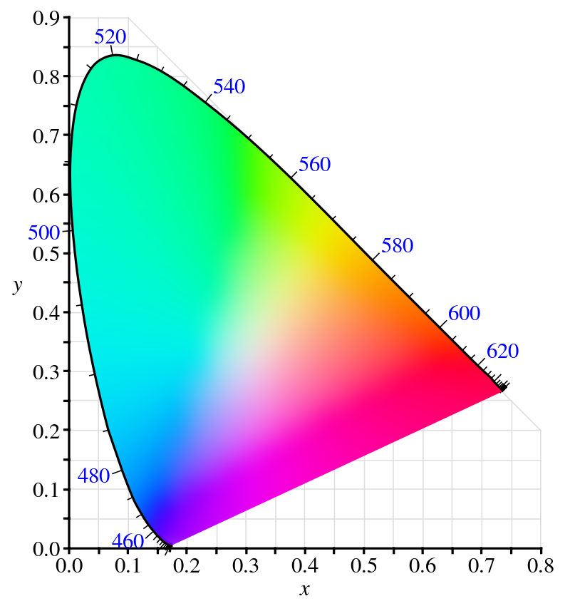
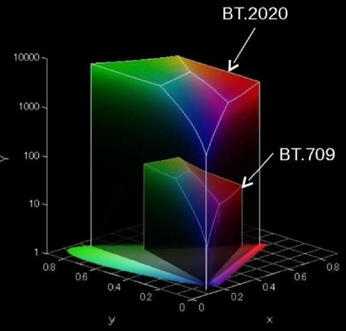

## 10:30 am Coffee

Got a latte and a cookie. The interview is on the 8th, there is 1 week left to study and prepare.

reviewing [pbrt color]()

### CIE 1931 color space

#### XYZ color space
XYZ color space spectral matching curves $X(\lambda), Y(\lambda), Z(\lambda)$      \
XYZ color space spectral matching curve $Y(\lambda)$ is proportional to luminance. \
XYZ color space coordinates $(x_\lambda, y_\lambda,z_\lambda)$.  

#### xyY color space 

$$
x= \frac{ x_\lambda }{ x_\lambda + y_\lambda + z_\lambda} \\
$$

$$
y= \frac{ y_\lambda }{ x_\lambda + y_\lambda + z_\lambda} 
$$

$$
z= 1-x-y
$$

xyY = $( x, y, y_\lambda )$, where $(x,y)$ specify chromacity, and $y_\lambda$ is proportional to luminance.




Converting between color spaces.
- EOTF: Encoded values -> linear light
- 3x3Mtx: Source->Target primaries
- Gamut: Colors outside gamut must be clipped or compressed.
- OETF: Linear Light -> encoded values.

https://docs.qualcomm.com/doc/80-78185-2/topic/overview.html#qualcomm-true-hdr


Scene lighting --> Camera OETF --> Display EOTF --> Display Light 

SDR: Gamma
HDR: PT (perceptual quantization st-2084), or hybrid-log gamma 

example: HDR10
- bit depth: 10
- chromacity: BT.2020
- eotf: ST 2084
- metadata: ST 2086

color volume mapping
- tone mapping: mastering display typically has higher luminance than playback display
- gamut mapping: mastering display typically has wider gamut than playback display


## 12:06 pm premultiplied alpha


### 2025-03-18 Premultiplied alpha
https://tomforsyth1000.github.io/blog.wiki.html \
https://shi-yan.github.io/note_on_alpha_blending \

First let's set some helper variables. Let $d^\prime$ represent the new backbuffer color, $d$ represent the old backbuffer color, 


$$
\begin{align*} 
\\ {FB}_{rgb} = d
\\ {texel}_{rgb} = c
\\ {texel}_{a} = a
\end{align*} 
$$


#### Conventional (straight) alpha blending

Aka straight alpha, or unassociated alpha


$$
\begin{align*} 
\\ A_{new} &= A_{src} + A_{dst} ( 1 - A_{src})
\\ C_{new} &= \frac{ C_{src} * A_{src} + C_{dst} A_{dst} (1-A_{src}) }{ A_{new} }
\end{align*} 
$$


Note that if the destination is opaque ($A_{dst} = 1$), then this simplifies to


$$
\begin{align*} 
\\ A_{new} &= 1
\\ C_{new} &=  C_{src} * A_{src} + C_{dst}  (1-A_{src})
\end{align*} 
$$


$C$ represents the color, disregarding opacity.
Conventional alpha blending is a intuitive lerp, but is also rubbish

#### Premultipled alpha

aka associated alpha


$$
\begin{align*} 
\\ C^\prime_{new} &= C^\prime_{src} + C^\prime_{dst} (1 - A_{src})
\\ A_{new} &= A_{src} + A_{dst} ( 1 - A_{src})
\end{align*} 
$$


Where $C^\prime = C * A $. \
Note that if the destination is opaque ($A_{dst} = 1$), then $A_{new}=1$. \
The $C^\prime$ represents emission, A represents occlusion.

### 2025-03-18 Premultiplied alpha part 2
https://tomforsyth1000.github.io/blog.wiki.html

Pros of premultiplied alpha (PMA)
- makes filtering work without halos
- makes alpha blending associative ((A o B) o C) = (A o (B o C))

Production rendering pipeline considerations
1. Texture authoring
2. Export to shipping disk images
3. Texture data stored in VRAM
4. Shader math
5. Output merger

In practie, 1. is in straight alpha.     \
Many studios immediately convert to PMA. \
But due to UGC, engines have to keep track of which textures are PMA and which arent.


## Alpha Compositing
https://ciechanow.ski/alpha-compositing/


$$
alpha = opacity * coverage 
$$

$$
transparency = 1 - alpha
$$


## GPUs prefer Premultiplication
https://www.realtimerendering.com/blog/gpus-prefer-premultiplication/

When filtering textures, premuply png color data by their unassociated alphas. \
PNG textures are always "unassociated".

For example, a half-transparent red texel in a PNG file is
PNG data: [255,0,0, 127]
Premultiplied version: [ 127, 0, 0, 127]


For GPUs, you **must** premultiply the texture’s RGB value by its alpha before a fragment shader samples it.

## https://www.adriancourreges.com/blog/2017/05/09/beware-of-transparent-pixels/


## 2:24 pm

(1,1,1) in sRGB corresponds to the chromacity of the D65 illuminant. \


Let's get back to some of the questions from [day 1 generalist questions]()

## Sphere-Sphere
- [x] Q: Given two spheres, determine if they intersect \
A: $\vec{V} \cdot \vec{V} < r_{sum}^2$.

Say we have two spheres.                                                                       \
Spheres $A$ has center $\vec{C_A}$ and radius $r_A$.                                           \
Spheres $B$ has center $\vec{C_B}$ and radius $r_B$.                                           \
Let the vector between them $\vec{V} = \vec{C_A}$ - $\vec{C_B}$                                \
Let the sum of the radaii $r_{sum} = r_A + r_B $                                               \
The distance $d = \lVert \vec{V}  \rVert$.                                                     \
They are intersecting if $d < r_{sum}$.                                                        \
As an optimization to avoid sqrt during normalization, we sqaure both sides                    \
$d^2 < r_{sum}^2$.                                                                         \
$\vec{V} \cdot \vec{V} < r_{sum}^2$.

If we want to find the intersection, see notesSphereSphereIntersection.png


## Occupancy

- [x] Q: What is meant by shader occupancy, and what affects occupancy?\
A: Occupancy measures the utilization of a compute unit's wavefront slots. It's limited by VGPRs, LDS, Thread Group Size, and Barriers. Higher helps hide latency by switching between wavefronts, but doesn't necessarily correlate to better performance if the shader is cache, memory, or compute bound.

https://gpuopen.com/learn/occupancy-explained/
Occupancy is the ratio of assigned wavefronts to the maximum available slots.
RDNA 2 has 16 slots per SIMD, so if it has 4 wavefronts in flight, its occupancy is 4/16 = 25%.
SIMDs hide latency by having multiple wavefronts in flight. While waiting for results of one wavefront to come back, the GPU can simply switch to a different wavefront.

Wavefronts can be assigned to a SIMD if there are enough resources available.
SIMD resources:
- VGPRs
- SGPRs
- Groupshared memory / LDS (local data share)

Better occupancy does not necessarily mean better performance. The cache can be thrashed too.

With RDNA, each wavefront is assigned a fixed number of SGPRs, so occupancy limiters are
- VGPRs
- LDS
- Thread Group Size
- Barriers

## Checkerboard shader

- [ ] Q: Author a shader that produces a checkerboard pattern

```glsl
// ver 1

// see https://iquilezles.org/articles/checkerfiltering/

void mainImage( out vec4 fragColor, in vec2 fragCoord )
{
    float c = 0.;
    vec2 uv = fragCoord/iResolution.y; // [0 to 1]
    uv *= 10.;                         // [0 to 10]
    uv = fract( uv * .5 );             // [0 to 1]...x5
    uv -= .5;                          // [-.5 to .5]...x5
    vec2 s = sign( uv );               // [-1][1]... x5    
    c = s.x * s.y;                     // [-1][1]... x5 in xor pattern ( -*-=+, -*+=-, +*-=-, +*+=+ )
    c = c * .5 + .5;                   // [0][1]... x5
    fragColor = vec4(0,0,0,1);
    fragColor.xyz += c;
}


```

```glsl
// ver 2

float Checker( vec2 uv )
{
    float n = 10.;
    uv = floor( uv * n );
    return mod( uv.x + uv.y, 2. );
}

void mainImage( out vec4 fragColor, in vec2 fragCoord )
{    
    vec2 uv = ( fragCoord - iResolution.xy / 2. ) / iResolution.y;
    float checker = 0.;
    
    if( uv.x > 0. )
    {
        float theta = iTime/6.;
        float c = cos( theta );
        float s = sin( theta);
        uv = vec2(
            uv.x * c + uv.y * -s,
            uv.x * s + uv.y * c );   
    }
    checker = Checker( uv );

    fragColor = vec4( checker, checker, checker, 1. );
}
```


```glsl
// ver 3
https://www.shadertoy.com/view/NfVXzd
// see https://iquilezles.org/articles/checkerfiltering/

mat2 RotateDeg( float deg )
{
  float rad = radians(deg);
  return mat2( cos(rad), -sin(rad), sin(rad), cos(rad) );
}

float SquareWave( float x ) // [ 1, 2, 3, ... ] -> [ 1, -1, 1, ... ]
{
  x = fract( x * .5 ) - .5;
  return -sign(x);
}

float TriangleWave( float x )
{
  return 1. - 2. * abs( fract( x * .5 ) - .5 ); 
}

vec2 TriangleWave( vec2 x )
{
  return 1. - 2. * abs( fract( x * .5 ) - .5 );
}

vec2 AverageSquareWave( vec2 uv, vec2 w )
{
    // f_{avg} = fract{ F(b) - F(a) }{ b - a }
    // where TriangleWave is the integral of a SquareWave
    vec2 a = uv - 0.5 * w;
    vec2 b = uv + 0.5 * w;
    vec2 i = (TriangleWave(b)-TriangleWave(a))/w; // analytical integral (box filter)
    return i;
}

float checkersGrad( in vec2 uv)
{
    vec2 ddx = dFdx( uv );
    vec2 ddy = dFdy( uv );
    vec2 w = max(abs(ddx), abs(ddy)) + 0.01;    // filter kernel
    vec2 i = AverageSquareWave( uv, w );
    return 0.5 - 0.5*i.x*i.y;                   // xor pattern
}

float checkers( vec2 uv )
{

    uv = fract( uv * .5 );              // [0 to 1]...x2
    uv -= .5;                           // [-.5 to .5]...x2
    vec2 s = sign( uv );                // [-1][1]... x2 
    float checker = s.x * s.y;          // [-1][1]... x2 in xor pattern ( -*-=+, -*+=-, +*-=-, +*+=+ )
    checker = checker * .5 + .5;        // [0][1]... x2
    return 1. - checker;                // [1][0]... x2
}


void mainImage( out vec4 fragColor, in vec2 fragCoord )
{
    
    float checker = 0.;
    vec2 uv = fragCoord/iResolution.y;  // [0 to 1]
    uv = RotateDeg( 15. ) * uv;         // rotate a bit (to see aliasing)
    uv *= 4.;                          // [0 to 4]
    
    fragColor = vec4(0,0,0,1);

    if( fract( iTime * .25 ) < .5 ) // 
        fragColor.xy = vec2( checkersGrad( uv ) );
    else 
        fragColor.xyz = vec3( checkers  ( uv )  );
        
    // fragColor.xyz = vec3( uv, 0. );
    //fragColor.xyz = vec3(  SquareWave( uv.y ) );
    //fragColor.xyz = vec3( TriangleWave( uv.y ) );
}
```

- [ ] Q: What is a BxDF and what are some requirements for a function to be a valid BxDF?
- [ ] Q: Is branching on a GPU slow? If it depends, what does it depend on?
- [ ] Q: What is a "Moiré pattern" and why might it show up?
- [ ] Q: Why is a z-prepass useful? When would it not be useful?
- [ ] Q: What is “gamma”?
- [ ] Q: Your "hello triangle" fails to produce a triangle. What are some problems you’d anticipate?
- [ ] Q: What makes a GPU fast? What are some tradeoffs made in achieving that acceleration?