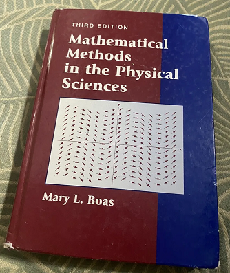
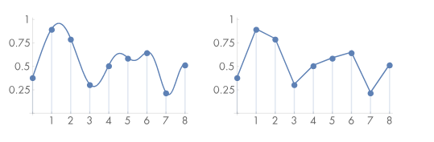
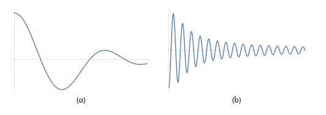
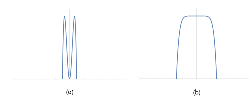
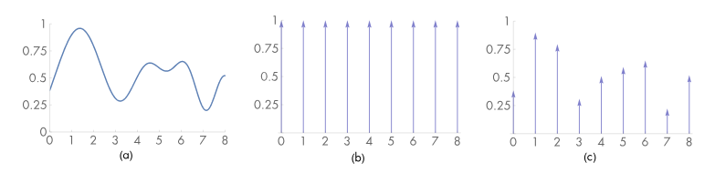
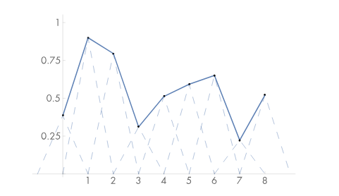
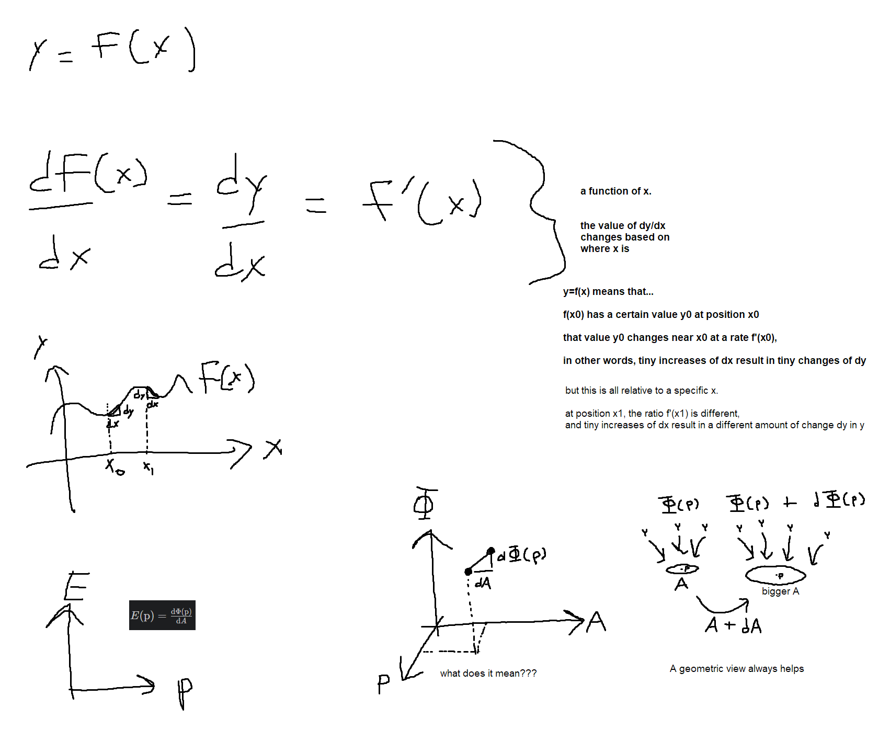

https://www.pbr-book.org/3ed-2018/Sampling_and_Reconstruction

Incident radiance is a continuous function, defined over the film plane. (it's defined at all positions, not just pixel centers)

**Sampling theory** takes discrete samples from continuous functions to reconstruct a new function similar to the original.

--- 

## 7.1 Sampling Theory
[pbrt](https://www.pbr-book.org/3ed-2018/Sampling_and_Reconstruction/Sampling_Theory#)

You could sample 1 the function at the pixel position, but you can get a better result by sampling multiple rays per pixel.

**Fourier analysis** can evaluate reconstructed function quality.

<!--

ch 7 has a good intro to Fourier
-->

Figure 7.1 Example function reconstructed from sampled piecewise linear signal.

--- 

### 7.1.1 The Frequency Domain and the Fourier Transform
[pbrt](https://www.pbr-book.org/3ed-2018/Sampling_and_Reconstruction/Sampling_Theory#TheFrequencyDomainandtheFourierTransform)

Figure 7.2 a low freq and high frequency function

And their frequency space representations

1D Fourier transform of $f(x)$. ($F$ is a **Linear** operator)


$$
F(\omega) = \int_{-\inf}^{\inf} \! f(x) \, e^{-i 2 \pi \w x} \, \dx \tag{7.1}
$$


Inverse fourier transform (aka Fourier synthesis equation)


$$
f(x) = \int_{-\inf}^{\inf} \! F(\w) \, e^{i 2 \pi \w x} \, \dw \tag{7.2}
$$


Dirac delta distribution is used for many frequequency space representations.

-  $\int \delta(x) \, \mathrm{d}x = 1$ 
- For all $x\ne0$, $\delta(x)=0$
- $\int \delta(x) \, f(x) \, \mathrm{d} x = f(0)$

--- 

### 7.1.2 Ideal Sampling and Reconstruction
[pbrt](https://www.pbr-book.org/3ed-2018/Sampling_and_Reconstruction/Sampling_Theory#IdealSamplingandReconstruction)

Computing sample locations from a function is the same as multipling with a "shah/impulse train/dirac comb" function.
$III$ represents the cryllic letter ш (shah), and ${III}_T$ has period $T$.


$$
{III} _ T(x) = T \sum\limits _{i=-\inf}^{\inf} \delta (x - i T)
$$



$$
{III}_T(x)f(x) = T \sum\limits _{i} \delta (x - i T) f(iT)
$$


Figure 7.4 Multiplication of a function with the shah ${III}_T$

The reconstructed function $\tilde{f}$ is found by a convolution with a filter $r(x)$


$$
\tilde{f}(x) = \Big({III}_T(x)f(x)\Big) \otimes r(x)
$$


where the convolution operator $\otimes$ is defined

$$
f(x) \otimes g(x) = \int _{-\infty}^{\infty} f(x^\prime) g(x-x^\prime)\dx^\prime
$$


The reconstructed function is a weighted sum of scaled instances of the reconstruction filter.


$$
\tilde{f}(x) = T \sum \limits _{i=-\infty}^{\infty}  f(iT) \, r(x-iT)
$$


---

#### Hold up, what? How did this happen?

[ ] Q: proof?

$$
\begin{align*}
\tilde{f}(x) &= \Big({III}_T(x)f(x)\Big) \otimes r(x) \\
\tilde{f}(x) &= \int _{-\infty}^{\infty} \Big({III}_T(x^\prime)f(x^\prime)\Big) r(x-x^\prime)\dx^\prime \\
\tilde{f}(x) &= \int _{-\infty}^{\infty} \Big(T \sum\limits _{i} \delta (x^\prime - i T) f(iT)\Big) r(x-x^\prime)\dx^\prime
\end{align*}
$$


---

Figure 7.5 reconstructed with the filter $r(x)=\max(0, 1-|x|)$

--- 

### 7.1.3 Aliasing
[pbrt](https://www.pbr-book.org/3ed-2018/Sampling_and_Reconstruction/Sampling_Theory#Aliasing)

---

### 7.1.4 Antialiasing Techniques
[pbrt](https://www.pbr-book.org/3ed-2018/Sampling_and_Reconstruction/Sampling_Theory#AntialiasingTechniques)

---

### 7.1.5 Application to Image Synthesis
[pbrt](https://www.pbr-book.org/3ed-2018/Sampling_and_Reconstruction/Sampling_Theory#ApplicationtoImageSynthesis)

---

### 7.1.6 Sources of Aliasing in Rendering
[pbrt](https://www.pbr-book.org/3ed-2018/Sampling_and_Reconstruction/Sampling_Theory#SourcesofAliasinginRendering)

---

### 7.1.7 Understanding Pixels
[pbrt](https://www.pbr-book.org/3ed-2018/Sampling_and_Reconstruction/Sampling_Theory#UnderstandingPixels)

---

