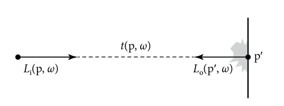
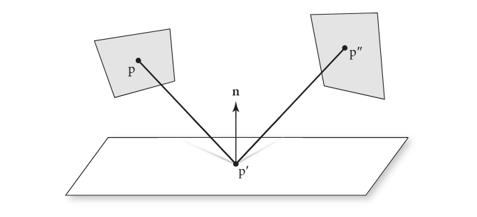
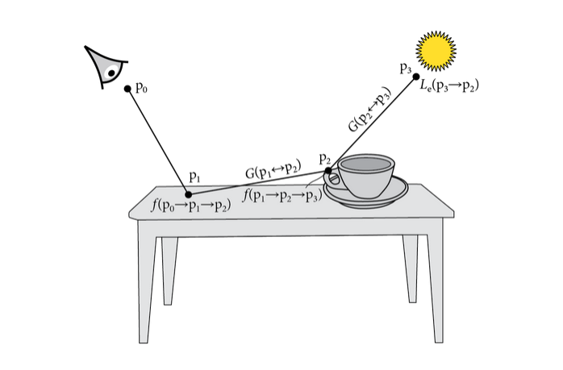

## 13 Light Transport I: Surface Reflection
[pbrt](https://pbr-book.org/4ed/Light_Transport_I_Surface_Reflection)

## 13.1 The Light Transport Equation

[pbrt](https://pbr-book.org/4ed/Light_Transport_I_Surface_Reflection/The_Light_Transport_Equation)

We will derive the LTE and describe approaches to solve numerically.

## 13.1.1 Basic Derivation
[pbrt](https://pbr-book.org/4ed/Light_Transport_I_Surface_Reflection/The_Light_Transport_Equation#BasicDerivation)

Conservation of power: $$\Phi_o - \Phi_i = \Phi_e - \Phi_a$$

$\Phi_o$: Power leaving an object \
$\Phi_i$: Power entering it \
$\Phi_e$: Power an object emits \
$\Phi_a$: Power an object absorbs

Using the ray-casting function:\
$$p^\prime = t(p, \omega)$$

we can write the incident radiance in terms of outgoing radiance
$$L_i(p,\omega) = L_o(t(p,\omega), -\omega)$$

LTE:
$$L_o(p,\omega_o)=L_e(p,\omega_o)+\int_{S^2} f(p,\omega_o, \omega_i)L_i(p,\omega_i)|cos\theta_i|\mathrm{d}\omega_i$$

LTE (with $L_o$ written as $L$, and $L_i$ in terms of $L$). You may refer to this as the LTE *energy balance* formation.
$$L(p,\omega_o)=L_e(p,\omega_o)+\int_{S^2} f(p,\omega_o, \omega_i)L( t(p,\omega_i) ,-\omega_i)|cos\theta_i|\mathrm{d}\omega_i \tag{13.1}$$

## 13.1.2 Analytic Solutions to the LTE
[pbrt](https://pbr-book.org/4ed/Light_Transport_I_Surface_Reflection/The_Light_Transport_Equation#AnalyticSolutionstotheLTE)

Impossible to solve analytically (without major simplifications). But some simple test cases can help debugging. For example, consider the interior of a lambertian emissive sphere (BSDF is $f(p,\omega_o,\omega_i)=c$)

$$L(p,\omega_o)=L_e+c\int_{H^2(n)} L(t(p,\omega_i), -\omega_i) |cos\theta_i|\mathrm{d}\omega_i$$

$L$ must be the same everywhere, so this simplifies to

$$L = L_e + c \pi L$$

replace $\pi c$ with $\rho_{hh}$, the lambertian surface reflectance

$$L = L_e + \rho_{hh} L$$

Instead of immediately solving for L, consider successive substitution of the right hand side into the L term of the right hand side.

$$L = L_e + \rho_{hh} ( L_e + \rho_{hh} ( L_e + ... $$
$$=\sum_{i=0}^{\inf} L_e \rho_{hh}^i$$

In other words, exitance radiance is equal to emitted radiance at a point plus light that has been scattered by a BSDF once, plus light that has been scattered twice, etc.

Because $\rho_{hh}<1$ (conservation of energy), the series converges (newmann series)

$$L=\frac{L_e}{1-\rho_{hh}}$$

This process of repeatedly substituting the LTE's right hand side into the $L_i$ term in the integral can be instructive, and a natural way for developing rendering algorithms (see also Arvo 1995a and Veach 1997).

## 13.1.3 The Surface Form of the LTE
[pbrt](https://pbr-book.org/4ed/Light_Transport_I_Surface_Reflection/The_Light_Transport_Equation#TheSurfaceFormoftheLTE)

We will write the LTE in area integral formation.

Assuming $p^{\prime}$ and $p$ are mutually visible, and $\omega = \widehat{ p - p^\prime }$, define exitant radiance from $p^\prime$ to $p$

$$L(p^\prime \rightarrow p) = L(p^\prime, \omega)$$

Rewrite the BSDF at $p^\prime$

$$f(p^{\prime\prime} \rightarrow p^{\prime} \rightarrow  p ) = f( p^{\prime}, \omega_o, \omega_i)$$

and $\omega_i = \widehat{ p^{\prime\prime} - p^{\prime}}$, \
and $\omega_o = \widehat{ p - p^{\prime}}$, 

Also need solid angle to area jacobian $|cos\theta^\prime|/r^2$.
Visibility function V = 1 if visible, 0 otherwise. Geometric term

$$ G ( p \leftrightarrow p^\prime) = V ( p \leftrightarrow p^\prime) \frac{ |cos\theta| |cos\theta^\prime|} { ||p-p^\prime||^2 } \tag{13.2}$$

LTE three-point form
 
$$ L(p^\prime \rightarrow p) = L_e( p^\prime \rightarrow p ) + \int_A f(p^{\prime\prime} \rightarrow p^{\prime} \rightarrow  p  )  L( p^{\prime\prime} \rightarrow p^\prime) G( p^{\prime \prime} \leftrightarrow p^\prime) \mathrm{d} A(p^{\prime\prime})  $$
$$\tag{13.3}$$

## 13.1.4 Integral over Paths
[pbrt](https://pbr-book.org/4ed/Light_Transport_I_Surface_Reflection/The_Light_Transport_Equation#IntegraloverPaths)

We will write the LTE in path integral formation. A path is a point in a high-dimensional path space. This LTE form is the foundation for bidirectional light transport algorithms.

Starting with the three-point LTE 



$$
L(\mathrm{p}_1 \rightarrow \mathrm{p}_0) = L_e( \mathrm{p}_1 \rightarrow \mathrm{p}_0 ) + \int_A f(\mathrm{p}_2 \rightarrow \mathrm{p}_1 \rightarrow  \mathrm{p}_0  )  L( \mathrm{p}_2 \rightarrow \mathrm{p}_1) G( \mathrm{p}_2  \leftrightarrow \mathrm{p}_1) \mathrm{d} A(\mathrm{p}_2) 
$$


The first substitution will replace the $L( \mathrm{p}_2 \rightarrow \mathrm{p}_1)$ in the integral with $L( p_3 \rightarrow \mathrm{p}_2)$.

$$ L(\mathrm{p}_1 \rightarrow \mathrm{p}_0) = L_e( \mathrm{p}_1 \rightarrow \mathrm{p}_0 ) + \int_A f(\mathrm{p}_2 \rightarrow \mathrm{p}_1 \rightarrow  \mathrm{p}_0  ) \Biggl[ L( p_3 \rightarrow \mathrm{p}_2) \Biggr] G( \mathrm{p}_2  \leftrightarrow \mathrm{p}_1) \mathrm{d} A(\mathrm{p}_2)  $$

$$ L(\mathrm{p}_1 \rightarrow \mathrm{p}_0) = L_e( \mathrm{p}_1 \rightarrow \mathrm{p}_0 ) + \int_A f(\mathrm{p}_2 \rightarrow \mathrm{p}_1 \rightarrow  \mathrm{p}_0  ) \Biggl[  L_e( \mathrm{p}_2 \rightarrow \mathrm{p}_1 ) + \int_A f(p_3 \rightarrow \mathrm{p}_2 \rightarrow  \mathrm{p}_1  )  L( p_3 \rightarrow \mathrm{p}_2)  G( p_3  \leftrightarrow \mathrm{p}_2) \mathrm{d} A(p_3)  \Biggr] G( \mathrm{p}_2  \leftrightarrow \mathrm{p}_1) \mathrm{d} A(\mathrm{p}_2)  $$

$$ L(\mathrm{p}_1 \rightarrow \mathrm{p}_0) = L_e( \mathrm{p}_1 \rightarrow \mathrm{p}_0 ) + \\
\int_A         L_e( \mathrm{p}_2 \rightarrow \mathrm{p}_1 ) f(\mathrm{p}_2 \rightarrow \mathrm{p}_1 \rightarrow  \mathrm{p}_0  ) G( \mathrm{p}_2  \leftrightarrow \mathrm{p}_1) \mathrm{d} A(\mathrm{p}_2) + \\
\int_A \int_A  L_e( p_3 \rightarrow \mathrm{p}_2 ) f(p_3 \rightarrow \mathrm{p}_2 \rightarrow  \mathrm{p}_1  ) f(\mathrm{p}_2 \rightarrow \mathrm{p}_1 \rightarrow  \mathrm{p}_0  ) G( p_3  \leftrightarrow \mathrm{p}_2) G( \mathrm{p}_2  \leftrightarrow \mathrm{p}_1)   \mathrm{d} A(p_3)  \mathrm{d} A(\mathrm{p}_2)  $$

So for $L(\mathrm{p}_1 \rightarrow \mathrm{p}_0)$, the first term is 0-bounce $L_e$, the second term is 1-bounce $L_e$, the third term is 2-bounce $L_e$.

Figure 13.3 shows two bounce $L_e$ arriving at $\mathrm{p}_0$.

With infinite substitutions, this can be rewritten as (with $\mathrm{p}_0$ on the film plane and $p_n$ on a light source)


$$ L( \mathrm{p}_1 \rightarrow \mathrm{p}_0) = \sum_{n=1}^\inf P( \overline{\mathrm{p}}_n ) \tag{13.4}$$


Given path $ {\overline{\mathrm{p}}}_n $

$${\overline{\mathrm{p}}}_n = \mathrm{p}_0 , \mathrm{p}_1 , ..., \mathrm{p}_n  $$



$$
P({{\overline{\mathrm{p}}}_{n}}) =  \underbrace{\int_A \int_A ... \int_A }_{n-1} L_e( p_n \rightarrow p_{n-1} ) \Biggl( \prod_{i=1}^{n-1} f( \mathrm{p}_{i+1} \rightarrow \mathrm{p}_i \rightarrow \mathrm{p}_{i-1}) \, G( \mathrm{p}_{i+1} \leftrightarrow \mathrm{p}_i) \Biggr) \mathrm{d}A(\mathrm{p}_2) \, ... \, \mathrm{d}A(p_n)
$$
$$
\tag{13.5}
$$


We will define the *throughput* of a path as


$$
T( \overline{\mathrm{p}}_n) = \prod_{i=1}^{n-1} f( \mathrm{p}_{i+1} \rightarrow \mathrm{p}_i \rightarrow \mathrm{p}_{i-1}) \, G( \mathrm{p}_{i+1} \leftrightarrow \mathrm{p}_i)  \tag{13.6}
$$


so


$$
P({{\overline{\mathrm{p}}}_{n}}) =  \underbrace{\int_A \int_A ... \int_A }_{n-1} L_e( p_n \rightarrow p_{n-1} ) T(\overline{\mathrm{p}}_n) \mathrm{d}A(\mathrm{p}_2) \, ... \, \mathrm{d}A(p_n)
$$


The monte carlo estimator of 13.4 looks like



$$
L(\mathrm{p}_1 \rightarrow \mathrm{p}_0 ) \approx  \sum_{n=1}^{\inf} \frac{P(\overline{ \mathrm{p} }_n)}{ p(\overline{\mathrm{p}}_n)} 
$$


## 13.1.5 Delta Distributions in the Integrand
[pbrt](https://pbr-book.org/4ed/Light_Transport_I_Surface_Reflection/The_Light_Transport_Equation#DeltaDistributionsintheIntegrand)

## 13.1.6 Partitioning the Integrand
[pbrt](https://pbr-book.org/4ed/Light_Transport_I_Surface_Reflection/The_Light_Transport_Equation#PartitioningtheIntegrand)

asdf

