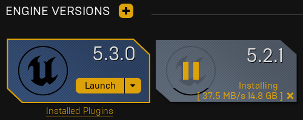

## h2
asdf

$$
x=3
$$

https://dev.epicgames.com/community/unreal-engine/learning
--> https://dev.epicgames.com/community/learning/tutorials/vEyw/lifecycle-of-a-texture-in-unreal-engine-for-virtual-production
--> https://www.youtube.com/watch?v=ibmSyKY6pmQ
  2:40

  png --> UE --> uasset
  [ ] Q: what is a uasset
         pixels
         mips
         srgb checkbox

  [ ] Q: where is the uasset
          DerivedDataCache?
  [ ] Q: where is the png

  [ ] Q: what is a pakmap
         it's a packed map, RMA or ARM
         R = roughness
         N = metallic
         A = ambient occlusion
         they are packed together, so you should uncheck the srgb checkbox in the uasset
         http://wiki.polycount.com/wiki/RMA

  8:34 why does ue make mips? to strive for 1:1 rendered px to texel
  11:00 virtual texture
    breaks up in sections of 180x180 texels
    for a table, the close edge could use mip0, farther use mip1

https://dev.epicgames.com/community/unreal-engine/learning
--> https://dev.epicgames.com/community/learning/tutorials/vyZ1/unreal-engine-begin-play-rendering
<!-- todo -->
  In this video, we look at a high-level overview of the rendering pipeline in Unreal Engine 5, from exploring every stage of the render pipeline, including; how the engine decides what and how to render our scene.

https://docs.unrealengine.com/5.3/en-US/

https://docs.unrealengine.com/5.3/en-US/
--> https://docs.unrealengine.com/5.3/en-US/understanding-the-basics-of-unreal-engine/

https://docs.unrealengine.com/5.3/en-US/
--> https://docs.unrealengine.com/5.3/en-US/graphics-programming-overview-for-unreal-engine/

https://docs.unrealengine.com/5.3/en-US/
--> https://docs.unrealengine.com/5.3/en-US/shader-development-in-unreal-engine/

---

https://docs.unrealengine.com/5.3/en-US/overview-of-shaders-in-plugins-unreal-engine/
  > For additional help, you can directly look at //Engine/Plugins/Compositing/LensDistortion's Plugin.

  "D:\Program Files\Epic Games\UE_5.3\Engine\Plugins\Compositing\LensDistortion"
  +--
    +-- Binaries
      +-- UnrealEditor.modules

          { "BuildId": "27405482",
            "Modules": {"LensDistortion": "UnrealEditor-LensDistortion.dll"} }

      +-- UnrealEditor-LensDistortion.dll
      +-- UnrealEditor-LensDistortion.pbd
    +-- Intermediate
      +-- contains stuff .precompiled, .obj. .lib, .cpp, .h, .generated.h
    +-- Resources
      +-- Icon128.png
    +-- Shaders
      +-- Private
        +-- UVGeneration.usf
            void MainVS(in uint GlobalVertexId : SV_VertexID,
                        out float2 OutVertexDistortedViewportUV : TEXCOORD0,
                        out float4 OutPosition : SV_POSITION)
              ...
            void MainPS(in noperspective float2 VertexDistortedViewportUV : TEXCOORD0,
                        in float4 SvPosition : SV_POSITION,
                        out float4 OutColor : SV_Target0 )
              ...
    +-- Source
      +-- LensDistortion
        +-- Classes
          +-- LensDistortionAPI.h

              USTRUCT(BlueprintType)
              struct LENSDISTORTION_API FLensDistortionCameraModel
              {
                GENERATED_USTRUCT_BODY()
                FLensDistortionCameraModel()
                {
                  K1 = K2 = K3 = P1 = P2 = 0.f;
                  F = FVector2D(1.f, 1.f);
                  C = FVector2D(0.5f, 0.5f);
                }

                UPROPERTY(...) float K1; UPROPERTY(...) float K2; UPROPERTY(...) float K3;
                UPROPERTY(...) float P1; UPROPERTY(...) float P2;
                UPROPERTY(...) FVector2D F; UPROPERTY(...) FVector2D C;

                FVector2D UndistortNormalizedViewPosition(FVector2D V) const;

                float GetUndistortOverscanFactor(
                  float DistortedHorizontalFOV,
                  float DistortedAspectRatio) const;

                void DrawUVDisplacementToRenderTarget( ... );

                bool operator == (const FLensDistortionCameraModel& Other) const
                  ...
                bool operator != (const FLensDistortionCameraModel& Other) const
                  ...
              };

          +-- LensDistortionBlueprintLibrary.h

              UCLASS(MinimalAPI, meta=(ScriptName="LensDistortionLibrary"))
              class ULensDistortionBlueprintLibrary : public UBlueprintFunctionLibrary
              {
                GENERATED_UCLASS_BODY()

                UFUNCTION(BlueprintPure, Category = "Lens Distortion" )
                static void GetUndistortOverscanFactor(...);
                  
                UFUNCTION(BlueprintCallable,
                          Category = "Lens Distortion",
                          meta = (  WorldContext = "WorldContextObject"))
                static void DrawUVDisplacementToRenderTarget(...);

                // == fn
                // != fn

        +-- Private
          +-- LensDistortion.cpp

            class FLensDistortion : public ILensDistortion
              void StartupModule() override;
              void ShutdownModule() override;
              IMPLEMENT_MODULE( FLensDistortion, LensDistortion )
            void FLensDistortion::StartupModule()
              FString PluginShaderDir = FPaths::Combine(
                IPluginManager::Get().FindPlugin(TEXT("LensDistortion"))->GetBaseDir(),
                TEXT("Shaders"));
              AddShaderSourceDirectoryMapping(TEXT("/Plugin/LensDistortion"), PluginShaderDir);

          +-- LensDistortionRendering.cpp

                // lots of shit

          +-- LensDistortionBlueprintLibrary.cpp

            ULensDistortionBlueprintLibrary(...)
              ...
            void ULensDistortionBlueprintLibrary::GetUndistortOverscanFactor
              ...
            void ULensDistortionBlueprintLibrary::DrawUVDisplacementToRenderTarget(
              ...

        +-- Public
          +-- ILensDistortion.h

              class ILensDistortion : public IModuleInterface
                // singleton interface
                static inline ILensDistortion& Get()
                  return FModuleManager::LoadModuleChecked< ILensDistortion >(
                    "LensDistortion" );

 
        +-- LensDistortion.Build.cs
            
            namespace UnrealBuildTool.Rules 
              class LensDistortion : ModuleRules 
                  PublicDependencyModuleNames.AddRange(
                    "Core CoreUObject Engine RenderCore RHI" )
                  PrivateDependencyModuleNames.AddRange( "Projects" )
            
    +-- CameraCalibrationOpenCV.tps

        <?xml version="1.0" encoding="utf-8"?>
          <TpsData xmlns:xsd="..." xmlns:xsi="...">
            <Name>Algorithm from 'Camera calibration With OpenCV' tutorial</Name>
            <Location>/Engine/Plugins/Compositing/LensDistortion/</Location>
            <Date>2017-05-18T16:38:02.6356382+01:00</Date>
            <Function>Algorithm for camera lens distortion/undistortion</Function>
            <Justification>Compositing framework of UE4.</Justification>
            <Eula>http://docs.opencv.org/2.4/doc/tutorials/calib3d/camera_calibration/camera_calibration.html</Eula>
            <RedistributeTo>
              <EndUserGroup>Licensees</EndUserGroup>
              <EndUserGroup>Git</EndUserGroup>
              <EndUserGroup>P4</EndUserGroup>
            </RedistributeTo>
            <LicenseFolder>None</LicenseFolder>
        </TpsData>

    +-- LensDistortion.uplugin

        {
          ...
          "Description" : "Plugin to generate UV displacement for lens distortion/undistortion on the GPU from standard camera model.",
          "Category" : "Compositing",
          "CreatedBy" : "Epic Games, Inc.",
          "CreatedByURL" : "https://epicgames.com",
          "EnabledByDefault" : false,
          "Installed" : false,
          "Modules" :
          [
            {
              "Name": "LensDistortion",
              "Type": "Runtime",
              "LoadingPhase": "PostConfigInit"
            }
          ]
        }

  (in unreal engine)
    edit --> plugins --> lens distortion

  dude idk if im on the right track... how do i use this plugin?

https://docs.unrealengine.com/5.3/en-US/creating-a-new-global-shader-as-a-plugin-in-unreal-engine/

---

https://dev.epicgames.com/community/learning -->
https://dev.epicgames.com/community/learning/tutorials/9Vjy/unreal-engine-1-introduction-to-c-unreal-5-3-c
<!-- todo -->

https://www.unrealengine.com/marketplace/en-US/learn/content-examples
<!-- todo -->

## your first hour in unreal

https://dev.epicgames.com/community/learning/courses/ZpX/your-first-hour-in-unreal-engine-5-0
<!-- todo -->
  removed store in launcher settings
  tried to change profile pic - impossible (atm)
  installed debug symbols (like a million gb)
  trying to get github access
  got github access
  https://github.com/EpicGames/UnrealEngine
  [ ] Q: whats the difference between downloading ue5 through ue launcher vs cloning the repo?
  says to install "Unreal Learning Kit"
    Create project
      It fails because my UE is 5.3 and it uses 5.1 max.

  as it turns out, theres another your-first-hour... but for 5.2
  lets install UE version 5.2.1 in addition to 5.3.0

  https://dev.epicgames.com/community/learning/courses/3ke/your-first-hour-in-unreal-engine-5-2/vvdk/your-first-hour-in-unreal-engine-5-2-overview

  install time
  

  also install "Online Learning Kit"
  https://unrealengine.com/marketplace/en-US/product/online-learning-kit

  creates a .uproject

  Created with Third Person Template.

  ---

  ### Viewport Nav

  RMB rotate camera
  LMB move camera fwd/bwd
  R+LMB, pan camera 
  RMB + WASDQE, move camera

  Left click - Select object
    WASD - select/translate/rotate/scale
    F - focus selected
    Alt + LMB: - Orbit camera around selected

  ### content drawer
    ...

https://dev.epicgames.com/community/unreal-engine/getting-started/games
--> https://dev.epicgames.com/community/learning/paths/yG/stack-o-bot

https://dev.epicgames.com/community/unreal-engine/getting-started/games
--> 

https://dev.epicgames.com/community/unreal-engine/getting-started/games
--> https://dev.epicgames.com/community/learning/paths/Z4/lyra-starter-game

https://dev.epicgames.com/community/learning/courses/Xwp/lighting-essential-concepts-and-effects
--> 
https://dev.epicgames.com/community/learning/courses/Xwp/unreal-engine-lighting-essential-concepts-and-effects/Jzz/lighting-effects
<!-- todo -->
  at 8:25 he makes a cool caustic material
  there are also project files

https://forums.unrealengine.com
--> https://forums.unrealengine.com/tags/c/development-discussion/rendering/36/unreal-engine

https://forums.unrealengine.com
--> https://forums.unrealengine.com/t/getting-started-rendering-references/6548
<!-- todo -->
  seems like it has good links to material stuff

https://forums.unrealengine.com/docs?category=36
