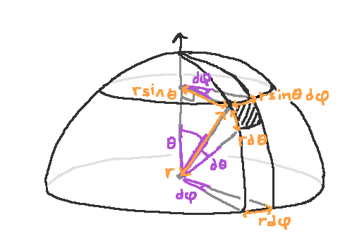
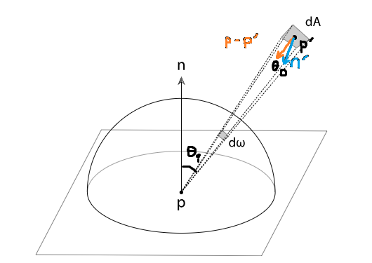
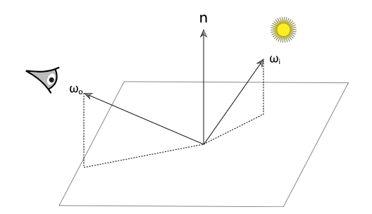

https://www.pbr-book.org/3ed-2018/Color_and_Radiometry

__Radiometry__ - Study of electromagnetic radiation (EMR) propagation

__Visible light__ - EMR wavelength (λ) 380 nm - 780 nm

EMR is described by 4 radiometric quantities
- flux
- intensity
- irradiance
- radiance

Each quantity is described by a __spectral power distribution__ (SPD) function.

I think of light as a whole bunch of photons, and each photon has a wavelength associated with it. The collection of all of these photons is called the spectrum, and the SPD shows how many photons are at each wavelength.

--- 

# 5.1 Spectral Representation

[pbrt](https://www.pbr-book.org/3ed-2018/Color_and_Radiometry/Spectral_Representation)

In pbrt this defaults to the `RGBSpectrum` class in [core/spectrum.cpp](https://github.com/mmp/pbrt-v3/tree/master/src/core/spectrum.h)

--- 

# 5.2 The SampledSpectrum Class

[pbrt](https://www.pbr-book.org/3ed-2018/Color_and_Radiometry/The_SampledSpectrum_Class)

(skipped)

--- 

## 5.2.1 XYZ Color

[pbrt](https://www.pbr-book.org/3ed-2018/Color_and_Radiometry/The_SampledSpectrum_Class#XYZColor)

__tri stimulus theory__ - all SPDs can be represented for humans with 3 values, $x_\lambda$, $y_\lambda$, $z_\lambda$


$$
x_\lambda = \int_\lambda \! S(\lambda) \, X(\lambda) \, \mathrm{d}\lambda
$$
$$
y_\lambda = \int_\lambda \! S(\lambda) \, Y(\lambda) \, \mathrm{d}\lambda
$$
$$
z_\lambda = \int_\lambda \! S(\lambda) \, Z(\lambda) \, \mathrm{d}\lambda
$$


Emissive SPD $S(\lambda)$ is integrated with __spectral matching curve__ $X(\lambda)$, $Y(\lambda)$, $Z(\lambda)$


note: the emissive SPD is given (the input)
x_\lambda y z are the outputs


Spectral Matching Curves $X(\lambda)$, $Y(\lambda)$, $Z(\lambda)$

Although XYZ represents SPDs well for a human, computation is better done with more accurate SPD representations, before being converted to XYZ.

XYZ coefficients are ($x_\lambda$, $y_\lambda$, $z_\lambda$)

```cpp
// Values of the spectral matching curves at each wavelength
const Float CIE_X[nCIESamples] = { ... }; 
const Float CIE_Y[nCIESamples] = { ... };
const Float CIE_Z[nCIESamples] = { ... };
```

```cpp
// Wavelengths that each spectral matching curve value corresponds to
const Float CIE_lambda[nCIESamples] = { ... };
```

--- 

## 5.2.2 RGB Color
[pbrt]( https://www.pbr-book.org/3ed-2018/Color_and_Radiometry/The_SampledSpectrum_Class#RGBColor)

Different LED displays have different emission curves.
|     |     |
| --- | --- |
|  |  |

I believe(?) these are the same as the display's spectral response curves $R(\lambda)$, $G(\lambda)$, $B(\lambda)$.

The same RGB values $(r,g,b)$ produce different SPDs on different displays.

Recall that ($x_\lambda$, $y_\lambda$, $z_\lambda$) is the representation of an SPD in XYZ space, $X(\lambda)$, $Y(\lambda)$, $Z(\lambda)$ are the XYZ spectral matching curves, and that $S(\lambda)$ is an emissive SPD.

A SPD in XYZ color space
$$
S(\lambda) =
x_\lambda X(\lambda) + 
y_\lambda Y(\lambda) + 
z_\lambda Z(\lambda) \\
$$

A SPD in RGB color space
$$
S(\lambda) =
r R(\lambda) + 
g G(\lambda) + 
b B(\lambda)
$$

Converting from XYZ to RGB color space

$$
\begin{align*}
r &= \int \! R(\lambda) \, S(\lambda)
                            \, \mathrm{d}\lambda \\
r &= \int \! R(\lambda) \, (x_\lambda X(\lambda) +
                            y_\lambda Y(\lambda) + 
                            z_\lambda Z(\lambda)) 
                            \, \mathrm{d}\lambda \\
r &= x_\lambda\int \! R(\lambda) \,  X(\lambda) \, \mathrm{d}\lambda +
     y_\lambda\int \! R(\lambda) \,  Y(\lambda) \, \mathrm{d}\lambda +
     z_\lambda\int \! R(\lambda) \,  Z(\lambda) \, \mathrm{d}\lambda 
\end{align*}
$$




$$
% define a macro intprod (integral product) for use outside the current group
\gdef\intprod#1#2{   \int \! #1(\lambda) \, #2(\lambda) \, \mathrm{d}\lambda }
$$




$$
\begin{bmatrix} r \\ g \\ b \end{bmatrix} = 
\begin{bmatrix} \intprod{R}{X} & \intprod{R}{Y} & \intprod{R}{Z} \\
                \intprod{G}{X} & \intprod{G}{Y} & \intprod{G}{Z} \\
                \intprod{B}{X} & \intprod{B}{Y} & \intprod{B}{Z} \end{bmatrix} 
\begin{bmatrix} x_\lambda \\ y_\lambda \\ z_\lambda \end{bmatrix}
$$


This conversion matrix has been precomputed in pbrt using standard RGB for high-def tv in `XYZtoRGB()`.


---

# 5.3 RGBSpectrum Implementation
[pbrt](https://www.pbr-book.org/3ed-2018/Color_and_Radiometry/RGBSpectrum_Implementation#)

(skipped)

---

# 5.4 Radiometry
[pbrt](https://www.pbr-book.org/3ed-2018/Color_and_Radiometry/Radiometry)

Make a couple assumptions based on __geometric optics__, such as __linearity__ and __no polarization__.

---

## 5.4.1 Basic Quantities
[pbrt](https://www.pbr-book.org/3ed-2018/Color_and_Radiometry/Radiometry#BasicQuantities)

1. Flux
2. Irradiance / radiant exitance
3. Intensity
4. Radiance

---

### Energy
[pbrt](https://www.pbr-book.org/3ed-2018/Color_and_Radiometry/Radiometry#x1-Energy)

Energy ($Q$) is measured in joules ($J$). A photon at wavelength $\lambda$ has energy

$$
Q=\frac{hc}{\lambda}
$$

where $c$ is the speed of light and $h$ is Planck's constant.

---

### Flux
[pbrt](https://www.pbr-book.org/3ed-2018/Color_and_Radiometry/Radiometry#x1-Flux)


__Radiant flux__ (aka __power__) is measured in joules/sec ($\frac{J}{s}$) or watts ($W$)

$$
\Phi = \frac{\mathrm{d}Q}
            {\mathrm{d}t}
$$

Given a light source that emitted $Q=200000J$ of energy over half an hour, the flux is $$\Phi=200000J/3600s\approx55W$$

If flux is a function of time, it can be integrated to find the total energy.


$$
Q=\int_{t_0}^{t1} \! \Phi(t) \, \mathrm{d}t
$$


---

### Irradiance and Radiant Exitance
[pbrt](https://www.pbr-book.org/3ed-2018/Color_and_Radiometry/Radiometry#x1-IrradianceandRadiantExitance)

Given area $A$, the average density of power over area is $E=\Phi/A$, measured in $W/m^2$

__Irradiance__ (E), area density of flux arriving at a surface\
__Radiant exitance__ (M), area density of flux leaving at a surface

Defined as the differential power per differential area at a point $p$
$$
E(\mathrm{p}) = \frac{\mathrm{d}\Phi(\mathrm{p})}{
                      \mathrm{d}A}
$$

Can also integrated over area to find power
$$
\Phi = \int_A E(p) dA
$$

__Lambert’s cosine law__ originates from the irradiance equation.


Figure 5.7

Two surfaces, $A_1$ and $A_2$ recieving light from a light source with area $A$ and flux $\Phi$.

The first surface has area $A_1 = A$.\
Then, because $A_2 \cos \theta = A$, the second surface has area $A_2 = \frac{A}{\cos \theta}$

<!---->

(Alternate presentation of figure 5.7)


Because the same amount of light is spread over a larger surface area, the irradiance at a given point in $A_2$ will be smaller than the irradiance at a given point in $A_1$.

The first surface has irradiance $E_1$ at any point inside $A_1$

$$
E_1 = \frac{\Phi }{ A_1 } = \frac{\Phi }{ A }
$$

The second surface has irradiance $E_2$ at any point inside $A_2$

$$
E_2 = \frac{\Phi }{ A_2 } = \frac{\Phi }{ ( \frac{A}{\cos \theta}  )  } = \frac{ \Phi \cos \theta}{A}
$$

---

### Solid Angle and Intensity
[pbrt](https://www.pbr-book.org/3ed-2018/Color_and_Radiometry/Radiometry#x1-SolidAngleandIntensity)


In 2D, an angle $\theta$ measured in __radians__ is equal to the arc length of an object subtended onto the unit circle.\
In 3D, a solid angle $sr$ measured in __steradians__ is equal to projected area of an object subtended onto a sphere.


<!---->

> Note: In pbrt, $\omega$ is a unit vector indicating a direction or a point on a unit sphere.

__Intensity__ ($I$) is the angular density of power. Over an entire sphere, $I = \frac{\Phi}{4 \pi}$, but more generally

$$
I = \frac{\mathrm{d} \Phi}{ \mathrm{d} \omega}
$$

As usual, intensity can be integrated over a set of directions $\Omega$ to recover the power

$$
\Phi = \int_\Omega I(\omega) d\omega
$$

Intensity is not really useful unless you use point lights.

---

### Radiance
[pbrt](https://www.pbr-book.org/3ed-2018/Color_and_Radiometry/Radiometry#x1-Radiance)

The most important radiometric quantity!

__Radiance__ ($L$). Although irradiance gives power per differential area at point $p$, it doesn't distinguish direction.
Radiance measures irradiance per solid angle, where $E_\omega$ is irradiance at a surface perpendicular to $\omega$.
$$
L(p,\omega)=\frac{dE_\omega(p)}{d\omega}
$$

In terms of flux, it is flux per unit solid angle $d\omega$ per unit projected area $dA^\perp$

$$
L(p,\omega)=\frac{d\Phi}{d\omega dA^\perp} \tag{5.2}
$$


Figure 5.10

--- 

`There's this thing that is confusing`, which is, what is the difference between $dA$, $dA^\perp$, $d\omega$, $d\omega^\perp$, and how are they related to $\cos \theta$ and $E_\omega$ and $E$ and $L$?

---

Recall the two surfaces $A_1$ and $A_2$ from figure 5.7 [earlier](#irradiance). Although both surfaces were receiving the same power ($\Phi$), the irradiance at a point in $A_2$ was smaller by a factor of $\cos \theta$ because the angle $\theta$ made the surface longer. $A_2 \cos \theta = A_1$
$$
E_1=\frac{\Phi}{A_1}
$$
$$
E_2=\frac{\Phi}{A_2}
$$


---

There is a document [02radiometry.pdf](http://www.cs.cornell.edu/courses/cs6630/2009fa/notes/02radiometry.pdf) by Steve Marschner that has two surfaces receiving the same power ($\Phi$). $dA^\prime$ has a larger area than $dA$, and thus should have a smaller irradiance $E$. However radiance $L$ is not measured relative to $dA^\prime$, but to $dA$.


In `02radiometry.pdf`, $\mathrm{d}A^\prime$ is tilted by the angle $\theta$, which makes it is longer than $\mathrm{d}A$, they are related by $\mathrm{d}A = \mathrm{d}A^\prime \cos \theta$. The radiance is written as

$$
L(\bold{x},\omega)= \frac{d^2\Phi}{dA \, d\omega} = 
                    \frac{d^2\Phi}{dA^\prime \, \cos \theta \, d\omega}
$$

It then lists 2 ways to hide the $\cos \theta$.
1. The $dA^\prime \cos \theta$ can be called the _"projected area"_ of $dA^\prime$ in the direction $\omega$.
2. The $d\omega \cos \theta$ can be called the _"projected solid angle"_

$dA$ in `02radiometry.pdf` is not the same $dA$ in `pbrt`.
- In `02radiometry.pdf`, $dA$ is perpendicular to $d\omega$, and $dA^\prime$ is __drawn__ more oblique because it's tilted by an angle $\theta$. They are related by $\mathrm{d}A = \mathrm{d}A^\prime \cos \theta$.
- In `pbrt` figure 5.10, $dA$ is perpendicular to the normal and $dA^\perp$ is __drawn__ more oblique because it's tilted away by an angle $\theta$. They are related by $dA^\perp=dA \cos \theta$


These two surfaces are receiving the same power $\Phi$ but on different areas, $dA$ and $dA^\perp$. The irradiance $E$ received at a point on $dA$ is given by

$E=\frac{\Phi}{dA}$

Whereas the irradiance $E_\omega$ received on the $dA^\perp$ is given by

$E_\omega=\frac{\Phi}{dA^\perp}$

The area $dA$ of $E$ is bigger than the area $dA^\perp$ of $E_\omega$, by a factor of $dA \cos \theta= dA^\perp$.

$E_\omega=\frac{\Phi}{dA \cos \theta}$

So I think the irradiance $E$ on the surface $dA$ is smaller than the irradiance $E_\omega$ on the surface $dA^\perp$, by a factor of $E_\omega \cos \theta= E$.

However, there's no such thing as _radiance_ at $dA$ being different to _radiance_ at $dA^\perp$. Radiance is measured at a point $p$ and is measured relative to $dA^\perp$.

---

## 5.4.2 Incident and Exitant Radiance Functions
[pbrt](https://www.pbr-book.org/3ed-2018/Color_and_Radiometry/Radiometry#IncidentandExitantRadianceFunctions)

(skipped)

---


## 5.4.3 Luminance and Photometry
[pbrt](https://www.pbr-book.org/3ed-2018/Color_and_Radiometry/Radiometry#LuminanceandPhotometry)

__Photometry__ is the study of EMR in terms of human perception.\
__Luminance__ ($Y$) measures how bright a SPD appears to a human. A green SPD will appear brighter than a blue SPD with the same energy.

$$
Y=\int_\lambda L(\lambda) V(\lambda) d\lambda
$$

$L(\lambda)$ is spectral radiance\
$V(\lambda)$ is the spectral response curve of human eye sensitivity to different wavelengths. Also known as the luminosity function, or CIE 1924 photopic luminous efficiency function.

$Y(\lambda)$ from the XYZ color is proportional to $V(\lambda)$
$$
Y=683\int_\lambda L(\lambda) Y(\lambda) d\lambda
$$

---

# 5.5 Working with Radiometric Integrals
[pbrt](https://www.pbr-book.org/3ed-2018/Color_and_Radiometry/Working_with_Radiometric_Integrals#)

Irradiance $E$ at point $p$ with normal $n$.


$$
% define a bunch of things to use later in this document
% ---

$$



$$
E(p,n)=\int_\Omega \! L_i(p,\omega) \, \abscostheta \, \domega \tag{5.4}
$$


$\theta$ is the angle between $\omega$ and $n$.\
The $\cos\theta$ is due to the $\mathrm{d}A^\perp$ radiance term.

---

How does this relate to the irradiance ($E$) equation, with projected _"stuff"_ and $\cos \theta$?

$$
\begin{align*}
E(\p,n)&=\int_\W \! L_i(\p,\w) \, \abscostheta \, \dw \\
\dE(\p,n)&=L_i(p,\w) \, \abscostheta \, \dw \\
\frac{\dE(\p,n)}{\abscostheta \, \dw}&=L_i(\p,\w) \\
\frac{d\Phi}{\dA \abscostheta \, \dw}&=L_i(\p,\w) 
\end{align*}
$$

Which can then be shorthanded in one of two ways, using projected area $dA^\perp$ or projected solid angle $d\omega^\perp$

$$
\frac{d\Phi}{dA^\perp  \, \mathrm{d}\omega}=L_i(p,\omega)
$$
$$
\frac{d\Phi}{dA \, \mathrm{d}\omega^\perp }=L_i(p,\omega)
$$


Expanding out irradiance ($E$) into the flux ($\Phi$) and area ($dA$) terms lets you use the projected area ($dA^\perp$) shorthand. However, if you keep irradiance as irradiance, because the $dA$ term is hidden into $E$, you can only use projected solid angle ($d\omega^\perp$).

---

## 5.5.1 Integrals over Projected Solid Angle
[pbrt](https://www.pbr-book.org/3ed-2018/Color_and_Radiometry/Working_with_Radiometric_Integrals#IntegralsoverProjectedSolidAngle)


Just like in `02radiometry.pdf`, the projected solid angle measure can be used to hide the $\cos \theta$ from the integral.



$$
\domegaperp = \abscostheta \, \domega
$$


$$
E(p,n)=\int_{H^2(n)} \! L_i(p,\omega) \, \domegaperp
$$


> note: $d\omega^\perp$ is always $\le d\omega$

The total flux can be computed via integral



$$
\Phi = \int_A \int_{H^2(n)} \! L_o(p, \omega) \, \costheta \, \domega \, \dA
$$
$$
\Phi = \int_A \int_{H^2(n)} \! L_o(p, \omega) \, \domegaperp \, \dA
$$


and I reckon it is also equal to

$$
\Phi = \int_A \int_{H^2(n)} \! L_o(p, \omega) \, \domega \, \dAperp
$$


---

## 5.5.2 Integrals over Spherical Coordinates
[pbrt](https://www.pbr-book.org/3ed-2018/Color_and_Radiometry/Working_with_Radiometric_Integrals#IntegralsoverSphericalCoordinates)



**Angles** ($\theta$, $d\theta$, $d\phi$) measured in **radians** are in **purple**\
**Distances/arc lengths** ($\sin \theta$, $d\theta$, $\sin\theta d\phi$) measured in **(...units?)** are in **orange**.\
Radius = 1.

- [ ] todo: draw in an orange radius $r$, and make it rsintheta rdtheta, rsinthetadphi

A vector $(x,y,z)$ can be written in terms of $(\theta, \phi)$ spherical coordinates



$$
\begin{align*}
x&=\sintheta \, \cosphi \\
y&=\sintheta \, \sinphi \\
z&=\costheta
\end{align*}
$$


So too can a solid angle integral


$$
\domega = \sintheta \, \dtheta \, \dphi \tag{5.5}
$$


The hemisphere integral (5.4) can be rewritten.


$$
E(p,n) = \int_0^{2\pi}
         \int_0^{\frac{\pi}{2}}
         \! L_i(p, \theta, \phi) \, \costheta \, \sintheta \, \dtheta \, \dphi
$$


If radiance is the same from all directions, simplifies to $E=\pi L_i$

The reverse coordinate system transform is
$$
\theta = acos( z)
$$
$$
\phi = atan2( y,x)
$$

---

## 5.5.3 Integrals over Area
[pbrt](https://www.pbr-book.org/3ed-2018/Color_and_Radiometry/Working_with_Radiometric_Integrals#IntegralsoverArea)

> Computing this value as an integral over directions is not straightforward, since given a particular direction it is nontrivial to determine if the quadrilateral is visible in that direction. It’s much easier to compute the irradiance as an integral over the area of the quadrilateral.
 
- [ ] Q: How is that any easier? Wouldn't it be non-trivial to determine if the quadrilateral is visible from $p$ to $p^\prime$


Sometimes integrals are more easily computed over the area of a light source ($\int_A$) instead of an integral over direction ($\int_\Omega$).

As viewed from point $p$,


$$
\domega = \frac{\dA \costheta }{r^2} \tag{5.6}
$$


Where $\theta$ is the angle between the $dA$ normal and vector to $p$.\
(I believe $\theta$ in (5.6) is $\theta_o$ below)

<!---->




$$
E(p,n) = \int_A \! L \cos \theta_i \, \frac{\cos \theta_o \, \dA}{r^2}
$$


---

# 5.6 Surface Reflection
[pbrt](https://www.pbr-book.org/3ed-2018/Color_and_Radiometry/Surface_Reflection#)

Reflection is modeled with __spectral__ and __directional__ distributions.

ie: A lemon is yellow (__spectral distribution__) no matter what direction you look at it from, but what you see in a bathroom mirror depends entirely on the viewing direction (__directional distribution__).

Light may enter and exit a material from different points, displaying __subsurface light transport__.

- BRDF (5.6.1) describes reflection ignoring subsurface light transport.
- BSSRDF (5.6.2) includes translucent materials

## 5.6.1 The BRDF
[pbrt](https://www.pbr-book.org/3ed-2018/Color_and_Radiometry/Surface_Reflection#TheBRDF)

The bidirectional reflectance distribution function (BRDF) formalizes surface reflectoin.


Figure 5.18: 4D brdf function


$$
\dE(\p,\wi) = L_i(\p, \wi) \, \costhetai \, \dwi \tag{5.7}
$$


> Pop quiz: What does the $\cos \theta$ term have to do with the normal?\
> (left as an exercise to the reader)

Due to linearity,

$$
\dLo(\p, \wo) \propto \dE( \p, \wi )
$$


The [constant of proportionality](https://www.khanacademy.org/math/cc-seventh-grade-math/cc-7th-ratio-proportion/7th-constant-of-proportionality/) defines the BRDF\
(this just a fancy way of saying $f_r=\frac{dL_o}{dE}$).


$$
f_r(\p, \wo, \wi) = \frac{\dLo(\p, \wo)}{\dE(\p, \wi)} = \frac{\dLo(\p, \wo)}{\Li(\p, \wi) \, \costhetai \, \dwi} \tag{5.8}
$$


Physically based BRDFs are
1. **Reciprocal**. $f_r(p, w_o, w_i) = f_r(p, w_i, w_o)$
2. **Energy conserving**. For all $w_o$,

$$
\int_{H^2(n)} \! f_r(\p, \wo, \w^\prime) \, \cos \theta^\prime \dw^\prime \le 1
$$


- [ ] todo: elaborate on the above equation

The R in BRDF is for reflection ($f_r$).\
The T in BTDF is for transmittance ($f_t$).\
The S in BSDF is for scattering ($f$ without any subscripts)

The __bidirectional transmittance distribution function__ (BTDF) is denoted $f_t(p, w_o, w_i)$, where $w_i$ and $w_o$ are on opposite hemispheres of $p$.

The BRDF and the BTDF together make up $f(p,w_o,w_i)$, the __bidirectional scattering distribution function__ (BSDF). The BSDF is defined by


$$
\dLo(\p, \wo) = f(\p,\wo, \wi) \, \Li(\p, \wi) \, \abscosthetai \, \dwi
$$



Two examples where $n$ may or may not lie on the same side as $w_i$, hence the absolute value around $\lvert \cos \theta \rvert$. This allows the use of the convention where the normal is assumed to point outside the surface.



$$
\Lo(\p, \wo) = \int_{S^2} f(\p,\wo, \wi) \, \Li(\p, \wi) \, \abscosthetai \, \dwi \tag{5.9}
$$


The fundamental __scattering equation__. When the domain is $H^2(n)$ instead of $S^2$, it is known as the __reflection equation__.

---

## 5.6.2 The BSSRDF
[pbrt](https://www.pbr-book.org/3ed-2018/Color_and_Radiometry/Surface_Reflection#TheBSSRDF)

The __bidirectional scattering surface reflectance distribution function__ (BSSRDF) includes subsurface light transport.


$$
S(\p_\o, \wo, \p_\i, \wi) = \frac{ \dLo( \p_\o, \wo)}{ \mathrm{d}\Phi (\p_\i, \wi) }
$$


---

### Question
The BSSRDF $S$ is a ratio of outgoing differential radiance to incoming differential flux. (Well it's the limit of the ratio?..) Why does the BSSRDF use differential flux ($\mathrm{d}\Phi$) and not differential irradiance ($\mathrm{d}E$)? The BRDF uses $\mathrm{d}E$.  

<!--
Answer(guess): Well first off, the question is improperly worded. The BSSRDF doesn't use $\mathrm{d}\Phi$, it uses $\mathrm{d}\Phi(\mathrm{p}_i,\omega_i)$. There's a difference.
-->

[Recall](#irradiance-and-radiant-exitance) the definition of irradiance. Here, $\Phi$ is a function of $\mathrm{p}$.
- $E(\mathrm{p})=\frac{\mathrm{d}\Phi(\mathrm{p})}{\mathrm{d}A}$

[Recall](#radiance) the definition of radiance, and equation (5.2). Here, $\Phi$ is a function of $\mathrm{p}$ and $\omega$.
- $L(\mathrm{p}, \omega)=\frac{\mathrm{d}E_\omega(\mathrm{p})}{\mathrm{d}\omega}$.  

- $L(\mathrm{p}, \omega)=\frac{\mathrm{d}\Phi(\mathrm{p}, \omega)}{\mathrm{d}\omega \, \mathrm{d}A^\perp}$   

Which we can alternatively write as

- $L(\mathrm{p}, \omega)=\frac{\mathrm{d}\Phi(\mathrm{p}, \omega)}{\mathrm{d}\omega^\perp \, \mathrm{d}A}$   

We can then include irradiance as part of radiance. Here, $\mathrm{d}E$ is a funciton of $\mathrm{p}$ and $\omega$.

- $L(\mathrm{p}, \omega)=\frac{\mathrm{d}E(\mathrm{p}, \omega)}{\mathrm{d}\omega^\perp}$   


Are we allowed to differentiate irradiance with respect to solid angle? The definition of irradiance is $E(\mathrm{p})$, there is no $\omega$ term.  
We are allowed. Although $E$ is not in terms of $\omega$, $\mathrm{d}E$ is. Recall equation (5.7) and think about what is a differential and what is calculus.

- $\mathrm{d}E(\mathrm{p}, \omega_i) = L_i(\mathrm{p}, \omega_i) \cos \theta_i \, \mathrm{d}\omega_i$

Whereas differential flux is defined in terms of radiance as
-  $ \mathrm{d}\Phi(\mathrm{p}_i, \omega_i) = L_i(\mathrm{p}_i, \omega_i) \, \cos \theta_i \, \mathrm{d}\omega_i \, \mathrm{d}A $ 

---

deleteme

Well like $d\Phi=L \, \mathrm{d}\omega \, \mathrm{d}A^\perp$, right? and

Well, differential flux is part of Radiance, which is part of Irradiance.

The differential flux is equal to the Radiance $L_i$ times the 

$$
\dPhi(\p_\i, \wi) = \Li(\p_\i, \wi) \, \abscosthetai \, \dwi \, \dA 
$$



$$
\frac{ \dPhi(\p_\i, \wi) }{\abscosthetai \, \dwi \, \dA} = \Li(\p_\i, \wi)  
$$


------


$$
\Lo( \p_\o, \wo)= \int_A \int_{H^2(n)} \! S(\p_\o, \wo, \p_\i, \wi) \, \Li(\p_\i, \wi) \, \abscosthetai \, \dwi \, \dA \tag{5.11}
$$


As the distance between points increases, the value of $S$ greatly diminishes.


---

