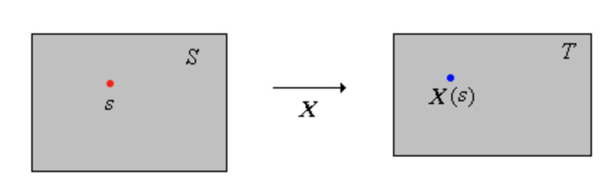

## Intro

Computer graphics often involves estimating complicated lighting integrals using monte carlo integration. This requires a background in random numbers and probability. By the end of this post you should understand the basics of probability, including the following terms and notations:

{{ }}

| Term                            | Notation       |
| ---                             | :---:          |
| Outcome                         | $s$            |
| Set of Outcomes                 | $S$            |
| Event                           | $A$            |
| Event Space                     | $\mathcal{S}$  |
| Sample Space                    | $\Omega$       |
| Probability Measure             | $\mathbb{P}$   |
| Random Variable                 | $X$            |
| Probability Distribution of $X$ | $\mathbb{P}_X$ |

## Example: Rolling a die

### Outcome

An **outcome** $s$ represents the result of an experiment.

- Before rolling, it could be one of many possible results
- After rolling, we observe the realized outcome, ie $s=5$.

### Set of Outcomes

The **set of outcomes** $S$ contains all possible **outcome** $s$

$$
S = \lbrace 1,2,3,4,5,6 \rbrace
$$

An outcome $s$ belongs to the set $S$:

$$
s \in S
$$

### Event

An **event** $A$ is a subset of **possible outcomes**.
$$
A \subseteq S
$$
For example:

|                                 |                                  |
| ---                             |  ---                             |
| $A = \lbrace 1, 3, 5 \rbrace$   | event for "rolled an odd number" |
| $B = \lbrace 5, 6 \rbrace$      | event for "rolled a 5 or higher" |
| $C = \lbrace 6 \rbrace$         | event for "rolled a 6"           |

{{ }}

If the **realized outcome** is $s=5$, events $A$ and $B$ occurred, and $C$ did not.

$$ s \in A $$
$$ s \in B $$
$$ s \not\in C $$

_Event $A$ occurs exactly when $s \in A$._

{{ }}

Each subset of $S$ is an **event**.                                  \
The _full event_ $S$, _always_ occurs: $s \in S$.                    \
The _empty event_ $\emptyset$, _never_ occurs: $s \not\in \emptyset$.

### Event Space

The **event space** $\mathcal{S}$ is the collection of all measurable **events**. It's a set of sets.
$$
\mathcal{S} = 2^S
$$

$2^S$ means "power set of S", which is the set of all subsets of $S$.        \
It contains $A$, $B$, $C$, $S$, $\emptyset$, and every other subset of $S$.  \
In fact, $\mathcal{S}$ contains $|\mathcal{S}| = 2^{|S|} = 2^6 = 64$ **events**.

### Probability Measure

A **probability measure** $\mathbb{P}$ assigns a probability to each **event** in the **event space**.

$$
\mathbb{P} : \mathcal{S} \to [0,1]
$$

The probability assigned to the entire **set of outcomes** $S$ is $1$

$$
\mathbb{P}(S)  = 1
$$

In the example or rolling a single die, we had the events

|                                 |                                  |
| ---                             |  ---                             |
| $A = \lbrace 1, 3, 5 \rbrace$   | event for "rolled an odd number" |
| $B = \lbrace 5, 6 \rbrace$      | event for "rolled a 5 or higher" |
| $C = \lbrace 6 \rbrace$         | event for "rolled a 6"           |

The associated **probability measures** $\mathbb{P}$ are:


$$
\begin{aligned}
\mathbb{P}(A) &= \mathbb{P}\big( \lbrace 1, 3, 5 \rbrace \big) = \frac{1}{2} \\
\mathbb{P}(B) &= \mathbb{P}\big( \lbrace 5, 6 \rbrace \big) = \frac{1}{3} \\
\mathbb{P}(C) &= \mathbb{P}\big( \lbrace 6 \rbrace \big) = \frac{1}{6}
\end{aligned}
$$


### Sample Space

The **sample space** $\Omega$ of an experiment is
$$
\Omega = (S, \mathcal{S})
$$

Informally, $\Omega$ is often used to refer to $S$.

{{ }}

Before we go into **random variables**, let's go through a couple examples.

## Examples

### Example: 1 coin flip


$$
\begin{aligned}
S^{(1)} &= \lbrace H, T \rbrace                              \\
s^{(1)} &\in S^{(1)}                                         \\
A^{(1)} &= \lbrace H \rbrace = \text{"result was heads"}
\end{aligned}
$$


### Example: 2 coin flips

The outcome records in order: (result of 1st flip, result of 2nd flip)


$$
\begin{aligned}
S^{(2)} &= \Big\lbrace ( s_1, s_2 ) : s_1, s_2 \in S^{(1)}  \Big\rbrace                    \\
&= \Big\lbrace (H, H), (H, T), (T, H), (T, T) \Big\rbrace                                  \\
s^{(2)} &= ( s _ 1, s_ 2) \in S^{(2)}                                                      \\ 
A_i^{(2)} &= \Big\lbrace ( s_1, s_2) \in S^{(2)} : s_i \in A^{(1)} \Big\rbrace , i = 1, 2
\end{aligned}
$$


Where $A_1^{(2)}$ is the event for "the 1st flip was Heads"
$$
A_1^{(2)} = \Big\lbrace ( H, H ), ( H , T) \Big\rbrace 
$$
And $A_2^{(2)}$ is the event for "the 2nd flip was Heads"
$$
A_2^{(2)} = \Big\lbrace ( H, H ), ( T, H ) \Big\rbrace 
$$

For example if the **realized outcome** was heads followed by tails, then:

$$
\begin{aligned}
s^{(2)} &=(H,T)            \\
s^{(2)} &\in A_1^{(2)}     \\
s^{(2)} &\notin A_2^{(2)} 
\end{aligned}
$$


### Example: N coin flips


$$
\begin{aligned}
S^{(N)} &= \Big\lbrace ( s _1, \dots,  s_N ) : s_i \in S^{(1)} \text{ for every } i = 1, \dots, N \Big\rbrace   \\
s^{(N)} &= ( s_ 1, \dots, s_N) \in S^{(N)}                                                  \\
A_i^{(N)} &= \Big\lbrace ( s_1, \dots,  s_N ) \in S^{(N)} : s_i \in A^{(1)}  \text{ for every } i = 1, \dots, N \Big\rbrace
\end{aligned}
$$


## Random Variable

A **random variable** is a measurement of interest. For example:
- the sum of throwing two dice
- the number of heads in several coin flips

Mathematically, a **random variable** $X$ is a function that transforms **outcomes** $s \in S$ to $X(s) \in T$.
$$
X:S \to T
$$
Although **random variable** $X$ is a function, it's written as variable whose realized value is unknown until we run the experiment. When **outcome** $s \in S$ occurs, $X$ takes on the realized value $X(s) \in T$

For $B \subseteq T$, the _preimage_ **event** $X^{-1}(B)$ in $S$ is written:

$$
\lbrace X \in B \rbrace = X^{-1}(B) = \lbrace s \in S: X(s) \in B \rbrace
$$

### Example: # of heads in 2 coin flips

Let $X$ be the number of heads in two coin flips. Here let's use 0 for tails and 1 for heads. \
The **outcome** $s$ is the ordered pair 

$$
s = (s_1, s_2) \in S = \lbrace 0, 1 \rbrace ^2
$$

X counts the number of heads
$$
X(s) = s_1 + s_2
$$

The full mapping is


$$
X : \lbrace 0, 1 \rbrace ^ 2 \to \lbrace 0, 1, 2 \rbrace  
$$


where

$$
S = \lbrace 0, 1 \rbrace ^ 2 = \Big\lbrace ( 1, 1 ), (1, 0), (0, 1) , (0,0) \Big\rbrace 
$$

$$
T = \lbrace 0, 1, 2 \rbrace 
$$

In this example
- $S$ is the **set of outcomes** from flipping two coins
- $T$ is the **set of outcomes** for the total number of heads.

{{ }}

The values of X are given by:


$$
\begin{aligned}
X(1,1) &= 2 \\
X(1,0) &= 1 \\
X(0,1) &= 1 \\
X(0,0) &= 0
\end{aligned}
$$


Note that $X(1,1) = 2$ is shorthand for $X\big((1,1)\big)=2$.

### Notation examples

1. If $x \in T$, then
    - $\lbrace X = x \rbrace = \Big\lbrace X \in \lbrace x \rbrace \Big \rbrace = \lbrace s \in S : X(s) = x \rbrace$

{{ }}

2. If $X$ is real-valued, and $a,b \in \mathbb{R}$, and $a<b$, then 
    - $\lbrace a \leq X \leq b \rbrace = \Big\lbrace X \in [ a, b ] \Big \rbrace = \lbrace s \in S :  a \leq X(s) \leq b  \rbrace$

{{ }}

3. If $T \subseteq \mathbb{R}^k$, then $X$ is a _random vector_ with each component a real-valued random variable $X_i$
    - $X=(X_1, X_2, \dots, X_k)$

{{ }}

4. The **outcome** itself can be thought of a random variable. Let $T=S$ and let $X$ be the identity function. Then:
    - $X(s) = s$ 
    - $\lbrace X \in A \rbrace = A$

### $\mathbb{P}_X$, the Probability Distribution of $X$

Recall that a **random variable** $X:S \to T$ maps outcomes to measurements. \
The **probability distribution** $\mathbb{P}_X$ of $X$ assigns each measurable set of values $B \subseteq T$ a probability $\mathbb{P}_X(B)$ describing how likely $X$ is to fall within $B$.

{{ }}

The **probability distribution** $\mathbb{P}_X$ is in itself a **probability measure**. The difference is:

- **probability measure** $\mathbb{P}$ assigns probabilities to events in $S$,
- **probability distribution** $\mathbb{P}_X$ assigns probabilities measurable sets of values in $T$

$$
\mathbb{P}_X( B ) = \mathbb{P}( X \in B ) = \mathbb{P}( X  ^ {-1} ( B ) )
$$ 

---

Recall from earlier, for $B \subseteq T$, the _preimage_ **event** $X^{-1}(B)$ in $S$ is written:

$$
\lbrace X \in B \rbrace = X^{-1}(B) = \lbrace s \in S: X(s) \in B \rbrace
$$

---

The _preimage_ of $B$ under $X$, written as $X  ^ {-1} ( B )$, is an **event** to which $\mathbb{P}$ can assign a probability.

#### $\mathbb{P}_X$ Example

Let's look at the two-coin flip example from earlier. The random variable $X$ counts the number of heads, so the _measurement_ $X(s)$ is the number of heads in the observed **outcome** $s$. We are interested in the  probability that this measurement belongs to the set $B = \lbrace 1 \rbrace \subseteq T$, that is the probability of flipping two coins and getting exactly one head.

{{ }}

What's the probability of this?
{{ }}
{{ }}

Let the **event** $A \subseteq S$ be the preimage of $B$ under $X$.

$$
A =   X  ^ {-1} ( B )  =  X  ^ {-1} \big( \lbrace 1 \rbrace \big)  = \big\lbrace (1,0), (0,1) \big\rbrace 
$$

$$
\mathbb{P}_X( B ) = \mathbb{P} (A) =  \mathbb{P} \bigg(  \big\lbrace (1,0), (0,1) \big\rbrace \bigg)
$$

The **sample space** $S$ has 4 possible outcomes, each of equal probability
$$
S = \big \lbrace (0,0), (0,1), (1,0), (1,1) \big \rbrace
$$
so getting an **outcome** $s \in A $ has a 50% chance.

### Discrete random variable

A **discrete random variable** $X$ has a countable image (range).

{{ }}

It has a **Discrete probability distribution**.

    -  described by a **probability mass function** (pmf)

---

## Triangle

asdf



## Cube

asdf



sources:
- https://stats.libretexts.org/Bookshelves/Probability_Theory/Probability_Mathematical_Statistics_and_Stochastic_Processes_(Siegrist)/02%3A_Probability_Spaces/2.02%3A_Events_and_Random_Variables

- https://en.wikipedia.org/wiki/Random_variable