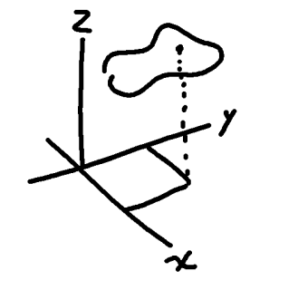

Let's say that you have a surface given by $ z=f(x,y) $

You want to find the tangent plane to that surface at a given point 

$ p_0 = \begin{bmatrix} x_0  \\ y_0 \\z_0 \end{bmatrix} $


https://www.geogebra.org/3d/vp4xwbhc

