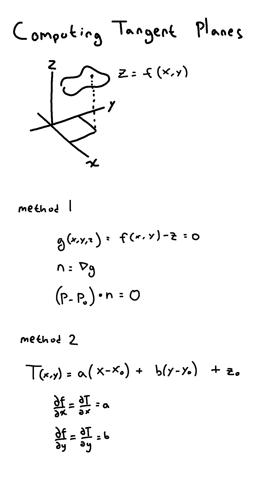
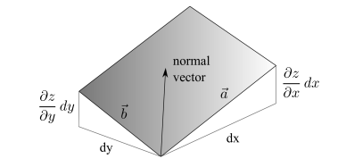
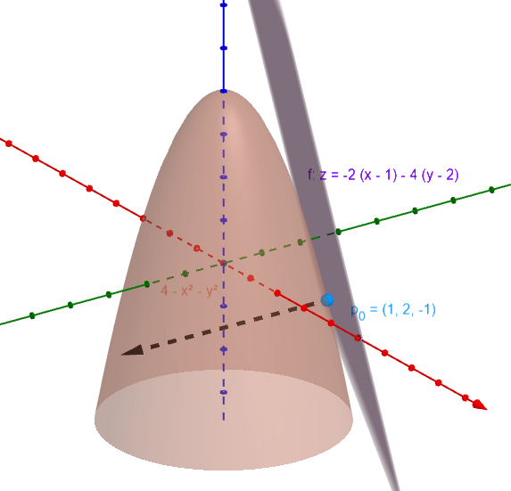
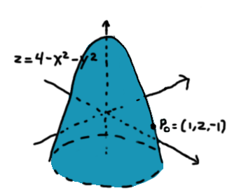
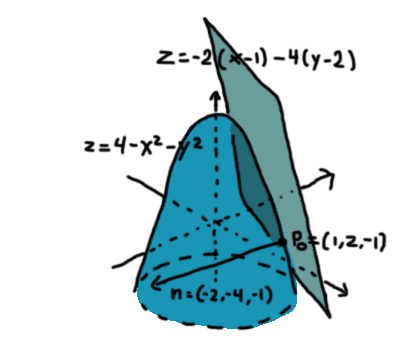

<!---->

## Explicit vs Implicit Surface

Let's say that you have a surface given by $z=f(x,y)$.

You want to find the tangent plane to that surface at a given point $p_0 = (x_0, y_0, z_0)$. There are two tangent plane equations to choose from.

The __explicit__ equation

$$
z = f(x_0, y_0) + f_x(x_0, y_0)(x-x_0) + f_y(x_0,y_0)(y-y_0)
$$


Or the __implicit__ equation

$$
0 = \nabla f \cdot (p - p_0 )
$$
where $p = (x, y, z)$

### What's the difference?

If you have a scalar function $g(x,y,z)$, you can define a couple things from its scalar field
- A __level set__ of a function $g(x,y,z)$ and a constant $C$ is the set of points in space that share the same value $C$. This is given by $g(x,y,z)=C$, where C is a constant. Different constants result in different level sets.
- The equation $g(x,y,z)=C$ represents an __isosurface__.  
  Every point on this surface has a value of C.
An isosurface is always a level set, but a level set is not necessarily an isosurface. The set of points in a level set may may not form a surface, or the level set may not even be in 3D, ie: $f(x,y)=C$
- The equation $g(x,y,z)=0$ represents an __implicit surface__, an isosurface with $C=0$

---

## Gradient as normal

The __gradient__ of a function $g(x,y,z)=C$ at a point is equal to its normal.

### Quick proof

<!--Parameterize a curve on the surface $r(t)=( x(t), y(t) , z(t) )$ -->
Let there be a parametric curve $r$ that lies on the surface of g


$$
r(t)=\begin{bmatrix} x(t) \\ y(t) \\ z(t) \end{bmatrix}
$$


Apply multivariable chain rule to the implicit surface $\frac{d}{dt}g(r(t))=0$

$$
\frac{\partial g}{\partial x}  \frac{dx}{dt} + \frac{\partial g}{\partial y}  \frac{dy}{dt} + \frac{\partial g}{\partial z}  \frac{dy}{dt} = 0
$$


$$
(
\frac{\partial g}{\partial x} 
\frac{\partial g}{\partial y} 
\frac{\partial g}{\partial z}
)
\cdot
(
\frac{\mathrm{d}x}{\mathrm{d}t}  
\frac{\mathrm{d}y}{\mathrm{d}t} 
\frac{\mathrm{d}z}{\mathrm{d}t}
) = 0
$$


$$
\nabla g \cdot r^{\prime}= 0
$$

This tells us that the gradient at a point $\nabla g(x_0, y_0,z_0)$ is orthogonal to the tangent vector $r^{\prime}(x_0,y_0,z_0)$ at that point on a curve that lies on the surface, so $n=\nabla g$

---

## Using the gradient

The implicit surface $g(x,y,z) = 0$ represents the same surface as $z=f(x,y)$ by setting

$$
g(x,y,z)=f(x,y)-z
$$

Then the normal $n$ is given by $\nabla g(x,y,z)$


$$
\begin{align*}
n &= \nabla g \\
n &= \nabla ( f-z ) \\
n &= \begin{bmatrix} f_x  \\ f_y  \\ -1 \end{bmatrix}
\end{align*}
$$


The equation of a plane is $(\begin{bmatrix} x \\ y \\ z \end{bmatrix} -\begin{bmatrix} x_0 \\ y_0 \\ z_0 \end{bmatrix})\cdot n = 0$

Expanding it out, we have

$$

\begin{align*}
\\ 0 &= (\begin{bmatrix} x \\ y \\ z \end{bmatrix} -\begin{bmatrix} x_0 \\ y_0 \\ z_0 \end{bmatrix})\cdot \begin{bmatrix} f_x  \\ f_y  \\ -1 \end{bmatrix} 
\\ 0 &= f_x(x-x_0)+ f_y(y-y_0) + (-1)(z-z_0) 
\\ z &= z_0 + f_x(x-x_0)+ f_y(y-y_0) 
\end{align*}
$$

Which is the explicit tangent plane equation from the beginning.

## Normal from Cross Product

An alternate method of computing the normal is to use the cross product of the partial derivative tangent vectors.

A small change in $x$ by $dx$ in produces a change in $z$ by $\frac{\partial z}{\partial x}dx$.

In this diagram, the tangent vector on the x-z plane is $\vec{a}=(dx,0,\frac{\partial z}{\partial x}dx)$  
The tangent vector on the y-z plane is $\vec{b}=(0,dy,\frac{\partial z}{\partial y}dy)$

We can divide out $\mathrm{d}x$ and $\mathrm{d}y$ to get proportional tangent vectors.

$\vec{a} \propto (1,0,z_x)$ and $\vec{b} \propto (0,1,z_y)$. Crossing them gives the normal.


$$
\begin{align*}
\\ n &= (1,0,z_x) \times (0,1,z_y)
\\ n &= \begin{bmatrix} -z_x \\ -z_y \\ 1 \end{bmatrix} 
\end{align*}
$$

Which gives the same normal as before, but flipped the other direction

## Example

Find the equation of the tangent plane to the surface $z = f(x,y) = 4-x^2 - y^2$ at the point $(1,2)$

<!---->

The point $p_0$ in 3d is given by

$$
\begin{align*}
\\ p_0 &= (1,2,f(1,2))
\\ p_0 &= (1,2,-1)
\\ \end{align*}   
$$


The implicit surface $g$ is given by

$$
\begin{align*} 
\\ g(x,y,z) &= f(x,y) - z 
\\ g(x,y,z) &= 4 - x^2 - y^2 - z 
\\ \end{align*}
$$


The normal $n$ as a function of position is given by

$$
\begin{align*} 
\\ n &=\nabla g
\\ n &=(-2x, -2y, -1)
\\ \end{align*}
$$


The normal $n_0$ at point $p_0$ is given by

$$
\begin{align*} 
\\ n_0 &= n(p_0)
\\ n_0 &= n(1,2,-1)
\\ n_0 &= (-2(1), -2(2), -1)
\\ n_0 &= (-2, -4, -1)
\\ \end{align*}
$$


Finally, the equation of the tangnet plane is given by

$$
\begin{align*} 
\\ 0 &= (p-p_0) \cdot n_0 
\\ 0 &= (\begin{bmatrix} x \\ y \\ z \end{bmatrix} - \begin{bmatrix} 1 \\ 2 \\ -1 \end{bmatrix}) \cdot \begin{bmatrix} -2 \\ -4 \\ -1 \end{bmatrix}   
\\ 0 &= -2(x-1) -4(y-2) + z
\\ z &= -2(x-1) -4(y-2) 
\\ \end{align*}
$$


## References

- https://www.khanacademy.org/math/multivariable-calculus/applications-of-multivariable-derivatives
- https://piazza.com/class_profile/get_resource/ielue3w9x1trv/igpjc2b9y2k1f9
- https://tutorial.math.lamar.edu/classes/calciii/DirectionalDeriv.aspx
- https://tutorial.math.lamar.edu/classes/calciii/gradientvectortangentplane.aspx
- https://sites.millersville.edu/bikenaga/calculus3/tangent-planes/tangent-planes.pdf

